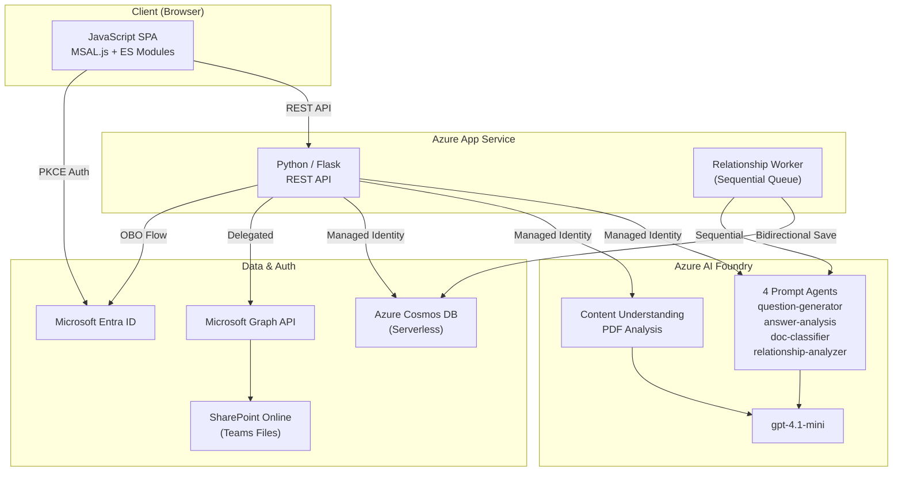

# Manufacturing Intelligent Document Management

製造業の設計開発プロセス（V モデル）の**左側（設計フェーズ）**に特化したドキュメント管理 Web アプリケーション。Teams/SharePoint 連携によるファイル管理、AI によるフォローアップ質問で暗黙知を抽出・蓄積し、ドキュメント間の上流/下流の依存関係を自動トレースする。

### V モデルにおけるカバー範囲

```
顧客要求・市場要求 ──────────────────────── 受入テスト
  │                                          │
  ▼                                          │
要件定義 ────────────────────────── システムテスト
  │                                    │
  ▼                                    │
基本設計 ──────────────────── 結合テスト
  │                              │
  ▼                              │
詳細設計 ────────────── 単体テスト
  │                        │
  ▼                        │
モジュール設計・実装準備    │
  │                        │
  ▼                        │
実装 ──────────────────┘

◀━━━━━━━━━ 本アプリのカバー範囲 ━━━━━━━━━▶
（左側：設計フェーズのドキュメントトレーサビリティ）
```

## Key Features

- **Teams/SharePoint 連携**: チャネルのファイルを直接管理・アップロード
- **AI ドキュメント分析**: Content Understanding で PDF を自動解析
- **暗黙知の抽出**: AI が設計文書の不足情報を質問し、エンジニアの知見を蓄積
- **自動トレーサビリティ**: ドキュメント間の依存関係 (`depends_on`) と参照関係 (`refers_to`) を AI が自動抽出・双方向保存
- **グラフ可視化**: チャネル全体の依存関係を左（上流）→右（下流）のステージ別グラフで表示
- **多言語対応**: 英語 / 日本語 UI 切り替え

## Architecture



### Technology Stack

| Layer | Technology |
|-------|-----------|
| Frontend | JavaScript (MSAL.js v2.35.0, ES Modules) |
| Backend | Python 3.10 / Flask |
| Database | Azure Cosmos DB (NoSQL, Serverless, RBAC-only) |
| Document Analysis | Azure Content Understanding (Foundry Tools) |
| AI Agents | Microsoft Foundry Agent Service (4 Prompt Agents) |
| Auth | Microsoft Entra ID (PKCE + OBO) |
| File Storage | Teams / SharePoint Online (Graph API) |
| Hosting | Azure App Service (Linux, B1) |
| IaC | Bicep + Azure Developer CLI (azd) |

## Prerequisites

- [Azure Developer CLI (azd)](https://learn.microsoft.com/azure/developer/azure-developer-cli/install-azd)
- [Python 3.10+](https://www.python.org/downloads/)
- Azure subscription
- Microsoft Entra ID app registration (SPA + Web API)

## Quick Start

### 1. Register Entra ID App

1. Azure Portal → **Microsoft Entra ID** → **App registrations** → **New registration**
2. Name: `Manufacturing Smart Doc Mgmt`
3. Supported account types: `Accounts in this organizational directory only`
4. Redirect URI: `Single-page application (SPA)` → (set after deploy)
5. After registration:
   - **Expose an API** → Set URI: `api://<client-id>` → Add scope: `access_as_user`
   - **API permissions** → Add delegated: `User.Read`, `Team.ReadBasic.All`, `Channel.ReadBasic.All`, `Files.ReadWrite.All`, `Sites.ReadWrite.All` → Grant admin consent
   - **Certificates & secrets** → New client secret → copy value

### 2. Configure and Deploy

```bash
azd init

# Only Entra ID values need manual setup — everything else is auto-provisioned
azd env set ENTRA_CLIENT_ID <client id>
azd env set ENTRA_CLIENT_SECRET <client secret>
azd env set ENTRA_TENANT_ID <tenant id>

azd up
```

This automatically provisions:
- **Azure Cosmos DB** (Serverless, RBAC-only)
- **Microsoft Foundry** (AI Services + Project)
- **Model deployments** (gpt-4.1-mini, text-embedding-3-large)
- **Foundry Agents**:
  - `question-generator-agent` — Follow-up question generation
  - `answer-analysis-agent` — Answer sufficiency evaluation
  - `doc-classifier-agent` — Document classification (6 process stages)
  - `relationship-analyzer-agent` — Upstream/downstream dependency analysis
- **Azure App Service** (Python 3.10, Linux)
- **RBAC role assignments** (Cosmos DB Data Contributor, Cognitive Services User)

### 3. Set Redirect URI

After deploy, update the Entra ID app registration:
- **SPA redirect URI**: `https://<your-app>.azurewebsites.net` (printed in azd output)

## Local Development

```bash
cd src/backend
python -m venv .venv
.venv/Scripts/activate  # Windows
pip install -r requirements.txt

# Copy frontend to static folder
xcopy /E /I /Y ..\frontend static  # Windows
# cp -r ../frontend/* static/      # Linux/Mac

python app.py
```

## Project Structure

```
├── azure.yaml              # azd project definition
├── infra/                  # Bicep IaC
│   ├── main.bicep
│   ├── main.parameters.json
│   ├── abbreviations.json
│   └── modules/
│       ├── ai-foundry.bicep
│       ├── ai-foundry-role-assignment.bicep
│       ├── app-service.bicep
│       ├── app-service-plan.bicep
│       ├── cosmos-db.bicep
│       └── cosmos-role-assignment.bicep
├── scripts/
│   └── create_agents.py    # Foundry Agent creation (postprovision hook)
├── src/
│   ├── backend/            # Flask API
│   │   ├── app.py
│   │   ├── config.py
│   │   ├── requirements.txt
│   │   ├── routes/
│   │   │   ├── auth_routes.py
│   │   │   ├── teams_routes.py
│   │   │   ├── document_routes.py
│   │   │   └── relationship_routes.py
│   │   └── services/
│   │       ├── auth_service.py
│   │       ├── graph_service.py
│   │       ├── cosmos_service.py
│   │       ├── content_understanding_service.py
│   │       ├── agent_service.py
│   │       └── relationship_service.py
│   └── frontend/           # JavaScript SPA
│       ├── index.html
│       ├── css/styles.css
│       └── js/
│           ├── app.js
│           ├── api.js
│           ├── auth.js
│           ├── config.js
│           ├── i18n.js
│           └── ui.js
└── docs/
    ├── APP_SPEC.md          # Application specification
    ├── ARCHITECTURE.md      # Architecture & flow diagrams
    └── RELATIONSHIP_SPEC.md # Document traceability specification
```
