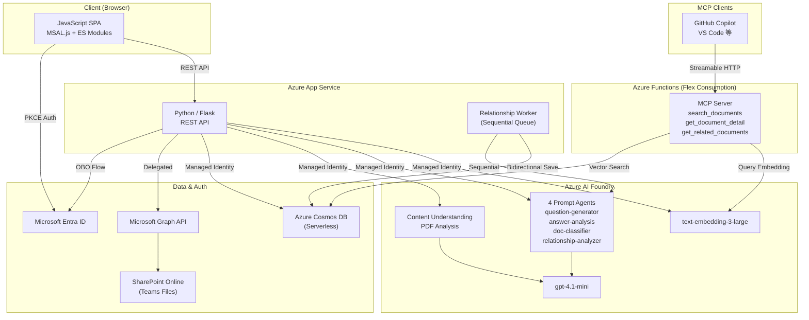
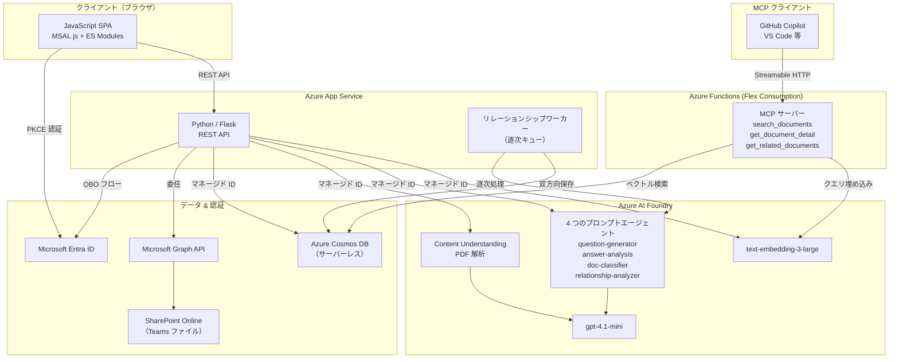

# Manufacturing Intelligent Document Management

A document management web application specialized for the **left side (design phase)** of the manufacturing design and development process (V-model). It provides file management through Teams/SharePoint integration, extracts and accumulates tacit knowledge via AI-driven follow-up questions, and automatically traces upstream/downstream dependencies between documents.

### V-Model Coverage

```
Customer / Market Requirements ─ ─ ─ ─ ─ ─ ─ ─ ─ Acceptance Test
  \                                                            /
    Requirements Definition ─ ─ ─ ─ ─ ─ ─ ─  System Test
      \                                                  /
        High-Level Design ─ ─ ─ ─ ─ ─ ─  Integration Test
          \                                        /
            Detailed Design ─ ─ ─ ─ ─  Unit Test
              \                              /
                Module Design / Impl.      /
                  \                      /
                    Implementation ──┘

  ◀━━━━━ Coverage of This App ━━━━━▶
  (Left side: Document traceability
         for the design phase)
```

## Key Features

- **Teams/SharePoint Integration**: Directly manage and upload channel files
- **AI Document Analysis**: Automatically analyze PDFs with Content Understanding
- **Tacit Knowledge Extraction**: AI asks questions about missing information in design documents to accumulate engineer expertise
- **Automatic Traceability**: AI automatically extracts and bidirectionally saves dependency (`depends_on`) and reference (`refers_to`) relationships between documents
- **Graph Visualization**: Display channel-wide dependency graphs by stage from left (upstream) to right (downstream)
- **MCP Server**: Semantic search and document retrieval via Model Context Protocol (Streamable HTTP)
- **Multilingual Support**: English / Japanese UI switching

## Architecture



### Technology Stack

| Layer | Technology |
|-------|-----------|
| Frontend | JavaScript (MSAL.js v2.35.0, ES Modules) |
| Backend | Python 3.10 / Flask |
| Database | Azure Cosmos DB (NoSQL, Serverless, RBAC-only) |
| Document Analysis | Azure Content Understanding (Foundry Tools) |
| AI Agents | Microsoft Foundry Agent Service (4 Prompt Agents) |
| Auth | Microsoft Entra ID (PKCE + OBO) |
| File Storage | Teams / SharePoint Online (Graph API) |
| Hosting | Azure App Service (Linux, B1) |
| IaC | Bicep + Azure Developer CLI (azd) |

## Prerequisites

- [Azure Developer CLI (azd)](https://learn.microsoft.com/azure/developer/azure-developer-cli/install-azd)
- [Python 3.10+](https://www.python.org/downloads/)
- Azure subscription
- Microsoft Entra ID app registration (SPA + Web API)

## Quick Start

### 1. Register Entra ID App

1. Azure Portal → **Microsoft Entra ID** → **App registrations** → **New registration**
2. Name: `Manufacturing Smart Doc Mgmt`
3. Supported account types: `Accounts in this organizational directory only`
4. Redirect URI: `Single-page application (SPA)` → (set after deploy)
5. After registration:
   - **Expose an API** → Set URI: `api://<client-id>` → Add scope: `access_as_user`
   - **API permissions** → Add delegated: `User.Read`, `Team.ReadBasic.All`, `Channel.ReadBasic.All`, `Files.ReadWrite.All`, `Sites.ReadWrite.All` → Grant admin consent
   - **Certificates & secrets** → New client secret → copy value

### 2. Configure and Deploy

```bash
azd init

# Only Entra ID values need manual setup — everything else is auto-provisioned
azd env set ENTRA_CLIENT_ID <client id>
azd env set ENTRA_CLIENT_SECRET <client secret>
azd env set ENTRA_TENANT_ID <tenant id>

azd up
```

This automatically provisions:
- **Azure Cosmos DB** (Serverless, RBAC-only)
- **Microsoft Foundry** (AI Services + Project)
- **Model deployments** (gpt-4.1-mini 100K TPM, text-embedding-3-large 100K TPM)
- **Content Understanding defaults** (model deployment mappings for `prebuilt-documentSearch`)
- **Foundry Agents**:
  - `question-generator-agent` — Follow-up question generation
  - `answer-analysis-agent` — Answer sufficiency evaluation
  - `doc-classifier-agent` — Document classification (6 process stages)
  - `relationship-analyzer-agent` — Upstream/downstream dependency analysis
- **Azure App Service** (Python 3.10, Linux)
- **Azure Functions** (Flex Consumption, MCP Server)
- **RBAC role assignments** (Cosmos DB Data Contributor, Cognitive Services User)

### 3. Set Redirect URI

After deploy, update the Entra ID app registration:
- **SPA redirect URI**: `https://<your-app>.azurewebsites.net` (printed in azd output)

## Local Development

```bash
cd src/backend
python -m venv .venv
.venv/Scripts/activate  # Windows
pip install -r requirements.txt

# Copy frontend to static folder
xcopy /E /I /Y ..\frontend static  # Windows
# cp -r ../frontend/* static/      # Linux/Mac

python app.py
```

## Project Structure

```
├── azure.yaml              # azd project definition
├── infra/                  # Bicep IaC
│   ├── main.bicep
│   ├── main.parameters.json
│   ├── abbreviations.json
│   └── modules/
│       ├── ai-foundry.bicep
│       ├── ai-foundry-role-assignment.bicep
│       ├── app-service.bicep
│       ├── app-service-plan.bicep
│       ├── cosmos-db.bicep
│       ├── cosmos-role-assignment.bicep
│       ├── mcp-app-insights.bicep
│       ├── mcp-function.bicep
│       └── mcp-storage.bicep
├── scripts/
│   ├── create_agents.py    # Foundry Agent creation (postdeploy hook)
│   └── create_vector_container.py  # Cosmos DB container with vector indexes
├── src/
│   ├── backend/            # Flask API
│   │   ├── app.py
│   │   ├── config.py
│   │   ├── requirements.txt
│   │   ├── routes/
│   │   │   ├── auth_routes.py
│   │   │   ├── teams_routes.py
│   │   │   ├── document_routes.py
│   │   │   └── relationship_routes.py
│   │   └── services/
│   │       ├── auth_service.py
│   │       ├── graph_service.py
│   │       ├── cosmos_service.py
│   │       ├── content_understanding_service.py
│   │       ├── agent_service.py
│   │       ├── embedding_service.py
│   │       └── relationship_service.py
│   ├── mcp-server/         # MCP Server (Azure Functions)
│   │   ├── function_app.py
│   │   ├── host.json
│   │   └── requirements.txt
│   └── frontend/           # JavaScript SPA
│       ├── index.html
│       ├── css/styles.css
│       └── js/
│           ├── app.js
│           ├── api.js
│           ├── auth.js
│           ├── config.js
│           ├── i18n.js
│           └── ui.js
└── docs/
    ├── APP_SPEC.md          # Application specification
    ├── ARCHITECTURE.md      # Architecture & flow diagrams
    ├── DOCS_MCP_SPEC.md     # MCP server & vectorization specification
    └── RELATIONSHIP_SPEC.md # Document traceability specification
```

## MCP Server Usage

This application includes an MCP (Model Context Protocol) server deployed as an Azure Functions Flex Consumption app. It provides semantic document search and retrieval tools that can be used by MCP-compatible clients such as GitHub Copilot in VS Code.

### Set Channel ID

The MCP server requires a Teams channel ID to scope document searches. Set it before deployment:

```bash
azd env set TEAMS_CHANNEL_ID <channel-id>
azd up
```

**Easiest way to get the channel ID:** Open the target channel in Microsoft Teams (browser or desktop app), copy the URL, and extract the `channel` parameter. For example:

```
https://teams.microsoft.com/l/channel/19%3A...%40thread.tacv2/General?groupId=...
                                      ^^^^^^^^^^^^^^^^^^^^^^^
                                     This is the channel ID (URL-encoded)
```

Copy the value between `/channel/` and the next `/` (e.g. `19%3A...%40thread.tacv2`). You can paste the URL-encoded value as-is — the server will decode it automatically.

### Get Connection Info

```bash
# Get the Function App name and MCP key
$rg = azd env get-value AZURE_RESOURCE_GROUP
$funcName = az functionapp list --resource-group $rg --query "[0].name" -o tsv
Write-Host "URL: https://$funcName.azurewebsites.net/runtime/webhooks/mcp"
az functionapp keys list --resource-group $rg --name $funcName --query "systemKeys.mcp_extension" -o tsv
```

### Configure in VS Code (`.vscode/mcp.json`)

```json
{
    "inputs": [
        {
            "type": "promptString",
            "id": "mcp-key",
            "description": "MCP Extension System Key",
            "password": true
        }
    ],
    "servers": {
        "manufacturing-docs": {
            "type": "http",
            "url": "https://<FUNCTION_APP_NAME>.azurewebsites.net/runtime/webhooks/mcp",
            "headers": {
                "x-functions-key": "${input:mcp-key}"
            }
        }
    }
}
```

### Available Tools

| Tool | Description |
|------|-------------|
| `search_documents` | Semantic vector search across all documents |
| `get_document_detail` | Retrieve full document content, classification, and Q&A |
| `get_related_documents` | Get upstream/downstream document relationships |

---

# 製造業インテリジェントドキュメント管理（日本語）

製造業の設計開発プロセス（V モデル）の**左側（設計フェーズ）**に特化したドキュメント管理 Web アプリケーション。Teams/SharePoint 連携によるファイル管理、AI によるフォローアップ質問で暗黙知を抽出・蓄積し、ドキュメント間の上流/下流の依存関係を自動トレースする。

### V モデルにおけるカバー範囲

```
顧客要求・市場要求 ─ ─ ─ ─ ─ ─ ─ ─ ─ ─  受入テスト
  \                                                    /
    要件定義 ─ ─ ─ ─ ─ ─ ─ ─ ─  システムテスト
      \                                          /
        基本設計 ─ ─ ─ ─ ─ ─ ─ ─  結合テスト
          \                                /
            詳細設計 ─ ─ ─ ─ ─  単体テスト
              \                        /
                モジュール設計・実装準備
                  \                /
                    実装 ──────┘

  ◀━━━━━ 本アプリのカバー範囲 ━━━━━▶
  （左側：設計フェーズの
     ドキュメントトレーサビリティ）
```

## 主な機能

- **Teams/SharePoint 連携**: チャネルのファイルを直接管理・アップロード
- **AI ドキュメント分析**: Content Understanding で PDF を自動解析
- **暗黙知の抽出**: AI が設計文書の不足情報を質問し、エンジニアの知見を蓄積
- **自動トレーサビリティ**: ドキュメント間の依存関係 (`depends_on`) と参照関係 (`refers_to`) を AI が自動抽出・双方向保存
- **グラフ可視化**: チャネル全体の依存関係を左（上流）→右（下流）のステージ別グラフで表示
- **MCP サーバー**: Model Context Protocol（Streamable HTTP）によるセマンティック検索・ドキュメント取得
- **多言語対応**: 英語 / 日本語 UI 切り替え

## アーキテクチャ



### 技術スタック

| レイヤー | テクノロジー |
|----------|-------------|
| フロントエンド | JavaScript (MSAL.js v2.35.0, ES Modules) |
| バックエンド | Python 3.10 / Flask |
| データベース | Azure Cosmos DB (NoSQL, サーバーレス, RBAC のみ) |
| ドキュメント解析 | Azure Content Understanding (Foundry Tools) |
| AI エージェント | Microsoft Foundry Agent Service (4 つのプロンプトエージェント) |
| 認証 | Microsoft Entra ID (PKCE + OBO) |
| ファイルストレージ | Teams / SharePoint Online (Graph API) |
| ホスティング | Azure App Service (Linux, B1) |
| IaC | Bicep + Azure Developer CLI (azd) |

## 前提条件

- [Azure Developer CLI (azd)](https://learn.microsoft.com/azure/developer/azure-developer-cli/install-azd)
- [Python 3.10 以上](https://www.python.org/downloads/)
- Azure サブスクリプション
- Microsoft Entra ID アプリ登録（SPA + Web API）

## クイックスタート

### 1. Entra ID アプリの登録

1. Azure Portal → **Microsoft Entra ID** → **アプリの登録** → **新規登録**
2. 名前: `Manufacturing Smart Doc Mgmt`
3. サポートされるアカウントの種類: `この組織ディレクトリのみに含まれるアカウント`
4. リダイレクト URI: `シングルページ アプリケーション (SPA)` →（デプロイ後に設定）
5. 登録後:
   - **API の公開** → URI を設定: `api://<client-id>` → スコープを追加: `access_as_user`
   - **API のアクセス許可** → 委任を追加: `User.Read`, `Team.ReadBasic.All`, `Channel.ReadBasic.All`, `Files.ReadWrite.All`, `Sites.ReadWrite.All` → 管理者の同意を付与
   - **証明書とシークレット** → 新しいクライアントシークレット → 値をコピー

### 2. 構成とデプロイ

```bash
azd init

# Entra ID の値のみ手動設定が必要 — それ以外はすべて自動プロビジョニング
azd env set ENTRA_CLIENT_ID <クライアント ID>
azd env set ENTRA_CLIENT_SECRET <クライアントシークレット>
azd env set ENTRA_TENANT_ID <テナント ID>

azd up
```

以下が自動的にプロビジョニングされます:
- **Azure Cosmos DB**（サーバーレス、RBAC のみ）
- **Microsoft Foundry**（AI Services + Project）
- **モデルデプロイメント**（gpt-4.1-mini 100K TPM, text-embedding-3-large 100K TPM）
- **Content Understanding デフォルト設定**（`prebuilt-documentSearch` 用モデルマッピング）
- **Foundry エージェント**:
  - `question-generator-agent` — フォローアップ質問の生成
  - `answer-analysis-agent` — 回答の十分性評価
  - `doc-classifier-agent` — ドキュメント分類（6 つのプロセスステージ）
  - `relationship-analyzer-agent` — 上流/下流の依存関係分析
- **Azure App Service**（Python 3.10, Linux）
- **Azure Functions**（Flex Consumption, MCP サーバー）
- **RBAC ロール割り当て**（Cosmos DB Data Contributor, Cognitive Services User）

### 3. リダイレクト URI の設定

デプロイ後、Entra ID アプリ登録を更新してください:
- **SPA リダイレクト URI**: `https://<your-app>.azurewebsites.net`（azd の出力に表示されます）

## ローカル開発

```bash
cd src/backend
python -m venv .venv
.venv/Scripts/activate  # Windows
pip install -r requirements.txt

# フロントエンドを static フォルダにコピー
xcopy /E /I /Y ..\frontend static  # Windows
# cp -r ../frontend/* static/      # Linux/Mac

python app.py
```

## プロジェクト構成

```
├── azure.yaml              # azd プロジェクト定義
├── infra/                  # Bicep IaC
│   ├── main.bicep
│   ├── main.parameters.json
│   ├── abbreviations.json
│   └── modules/
│       ├── ai-foundry.bicep
│       ├── ai-foundry-role-assignment.bicep
│       ├── app-service.bicep
│       ├── app-service-plan.bicep
│       ├── cosmos-db.bicep
│       ├── cosmos-role-assignment.bicep
│       ├── mcp-app-insights.bicep
│       ├── mcp-function.bicep
│       └── mcp-storage.bicep
├── scripts/
│   ├── create_agents.py    # Foundry エージェント作成（postdeploy フック）
│   └── create_vector_container.py  # ベクトルインデックス付き Cosmos DB コンテナ作成
├── src/
│   ├── backend/            # Flask API
│   │   ├── app.py
│   │   ├── config.py
│   │   ├── requirements.txt
│   │   ├── routes/
│   │   │   ├── auth_routes.py
│   │   │   ├── teams_routes.py
│   │   │   ├── document_routes.py
│   │   │   └── relationship_routes.py
│   │   └── services/
│   │       ├── auth_service.py
│   │       ├── graph_service.py
│   │       ├── cosmos_service.py
│   │       ├── content_understanding_service.py
│   │       ├── agent_service.py
│   │       ├── embedding_service.py
│   │       └── relationship_service.py
│   ├── mcp-server/         # MCP サーバー (Azure Functions)
│   │   ├── function_app.py
│   │   ├── host.json
│   │   └── requirements.txt
│   └── frontend/           # JavaScript SPA
│       ├── index.html
│       ├── css/styles.css
│       └── js/
│           ├── app.js
│           ├── api.js
│           ├── auth.js
│           ├── config.js
│           ├── i18n.js
│           └── ui.js
└── docs/
    ├── APP_SPEC.md          # アプリケーション仕様
    ├── ARCHITECTURE.md      # アーキテクチャ & フロー図
    ├── DOCS_MCP_SPEC.md     # MCP サーバー & ベクトル化仕様
    └── RELATIONSHIP_SPEC.md # ドキュメントトレーサビリティ仕様
```

## MCP サーバーの利用方法

本アプリケーションには、Azure Functions Flex Consumption プランでデプロイされる MCP（Model Context Protocol）サーバーが含まれています。VS Code の GitHub Copilot などの MCP 対応クライアントから、ドキュメントのセマンティック検索・取得が可能です。

### チャネル ID の設定

MCP サーバーはドキュメント検索のスコープとして Teams チャネル ID が必要です。デプロイ前に設定してください:

```bash
azd env set TEAMS_CHANNEL_ID <チャネル ID>
azd up
```

**チャネル ID の最も簡単な取得方法:** Microsoft Teams（ブラウザまたはデスクトップアプリ）で対象チャネルを開き、URL をコピーして `channel` パラメータを抽出します。例:

```
https://teams.microsoft.com/l/channel/19%3A...%40thread.tacv2/General?groupId=...
                                      ^^^^^^^^^^^^^^^^^^^^^^^
                                     これがチャネル ID（URL エンコード済み）
```

`/channel/` と次の `/` の間の値（例: `19%3A...%40thread.tacv2`）をコピーしてください。URL エンコードされたままの値をそのまま使用できます — サーバー側で自動的にデコードされます。

### 接続情報の取得

```bash
# Function App 名と MCP キーを取得
$rg = azd env get-value AZURE_RESOURCE_GROUP
$funcName = az functionapp list --resource-group $rg --query "[0].name" -o tsv
Write-Host "URL: https://$funcName.azurewebsites.net/runtime/webhooks/mcp"
az functionapp keys list --resource-group $rg --name $funcName --query "systemKeys.mcp_extension" -o tsv
```

### VS Code での設定 (`.vscode/mcp.json`)

```json
{
    "inputs": [
        {
            "type": "promptString",
            "id": "mcp-key",
            "description": "MCP Extension System Key",
            "password": true
        }
    ],
    "servers": {
        "manufacturing-docs": {
            "type": "http",
            "url": "https://<FUNCTION_APP_NAME>.azurewebsites.net/runtime/webhooks/mcp",
            "headers": {
                "x-functions-key": "${input:mcp-key}"
            }
        }
    }
}
```

### 利用可能なツール

| ツール | 説明 |
|--------|------|
| `search_documents` | 全ドキュメントに対するセマンティックベクトル検索 |
| `get_document_detail` | ドキュメントの全内容・分類・Q&A を取得 |
| `get_related_documents` | 上流/下流のドキュメント関係を取得 |
