# Architecture Overview — Manufacturing Intelligent Document Management

> 本ドキュメントは、システム全体のアーキテクチャ、各コンポーネントの役割、およびAIエージェントの動作フローを詳細に説明する。

---

## 1. システム全体アーキテクチャ

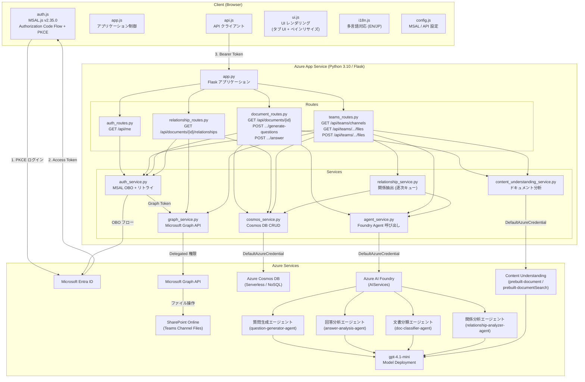

---

## 2. 認証フロー

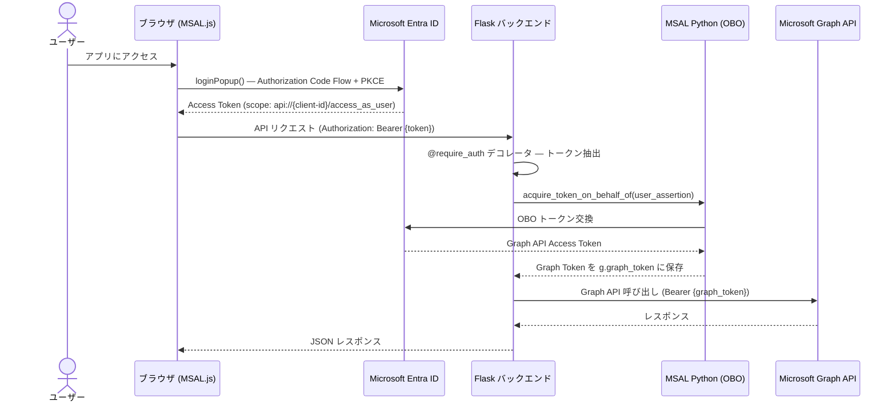

### 認証の二層構造

| レイヤー | 方式 | 用途 |
|---------|------|------|
| フロントエンド → バックエンド | MSAL.js (PKCE) | ユーザー認証、API アクセストークン取得 |
| バックエンド → Graph API | MSAL Python (OBO) | ユーザー委任権限での Graph API 呼び出し |
| バックエンド → Azure Services | DefaultAzureCredential (Managed Identity) | Cosmos DB, Content Understanding, Foundry Agent |

---

## 3. Teams チャネル選択フロー

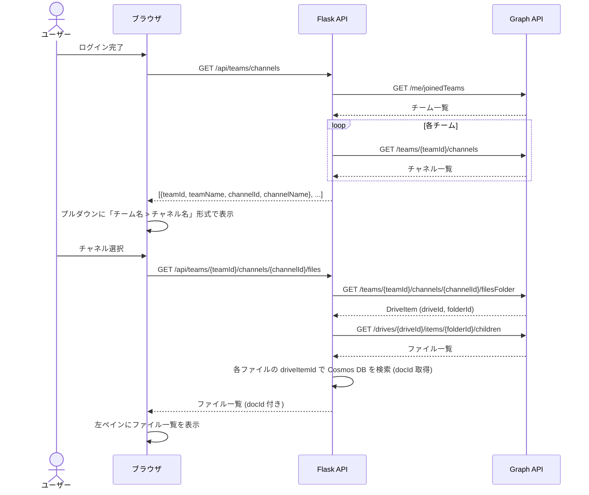

---

## 4. ファイルアップロード — 全体処理フロー

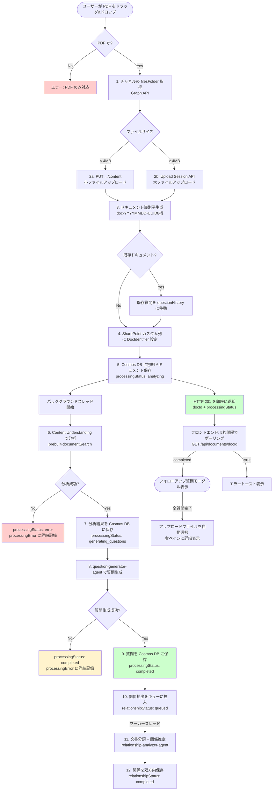

---

## 5. Content Understanding 分析フロー

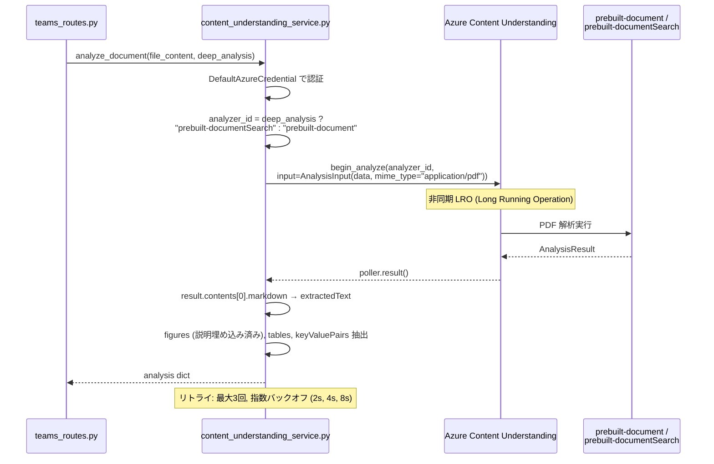

### Content Understanding 出力構造

```json
{
  "modelVersion": "prebuilt-documentSearch-v1",
  "analyzedAt": "2026-03-15T14:35:00Z",
  "extractedText": "... (Markdown 形式テキスト、図の説明埋め込み) ...",
  "figures": [{"figureId": "fig-001", "description": "...", "boundingBox": {"page": 3}}],
  "tables": [{"rowCount": 5, "columnCount": 3}],
  "keyValuePairs": [{"key": "Part Number", "value": "ABC-123"}]
}
```

---

## 6. AI エージェント詳細アーキテクチャ

### 6.1 エージェント構成概要

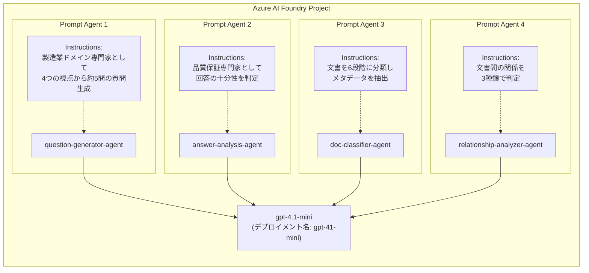

### 6.2 question-generator-agent (質問生成エージェント)

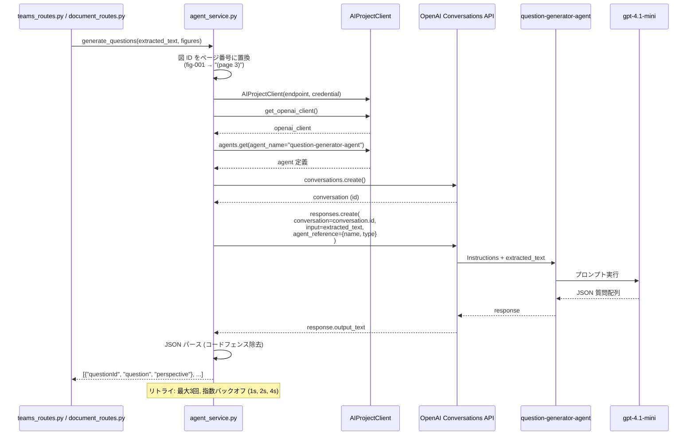

#### 質問生成の4つの視点

| 視点 | キー | 説明 |
|------|------|------|
| 前提条件 | `unstated_assumptions` | 経験豊富なエンジニアが不可欠と考える暗黙の前提 (環境条件、材料特性、運用制約) |
| 論理ギャップ | `logical_gaps` | 推論の飛躍や結論が前提から完全に導かれていない部分 |
| 経験知 | `experience_knowledge` | 実践や過去の失敗からのみ得られる知見 (故障モード、保守の落とし穴) |
| 見落としリスク | `overlooked_risks` | 品質問題、安全リスク、生産非効率を引き起こす可能性のある見落とし |

#### 出力形式

```json
[
  {
    "questionId": "q-001",
    "question": "What temperature range was assumed for this component?",
    "perspective": "unstated_assumptions"
  },
  {
    "questionId": "q-002",
    "question": "What common failure modes have been observed in similar designs?",
    "perspective": "experience_knowledge"
  }
]
```

### 6.3 answer-analysis-agent (回答分析エージェント)

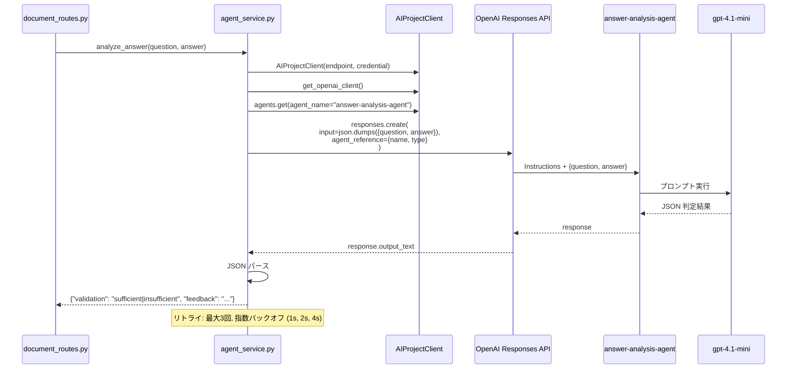

#### 判定ポリシー (寛容なアプローチ)

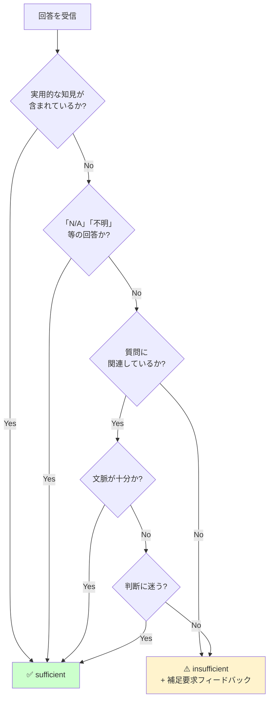

---

## 7. フォローアップ質問応答フロー (チャットスレッド)

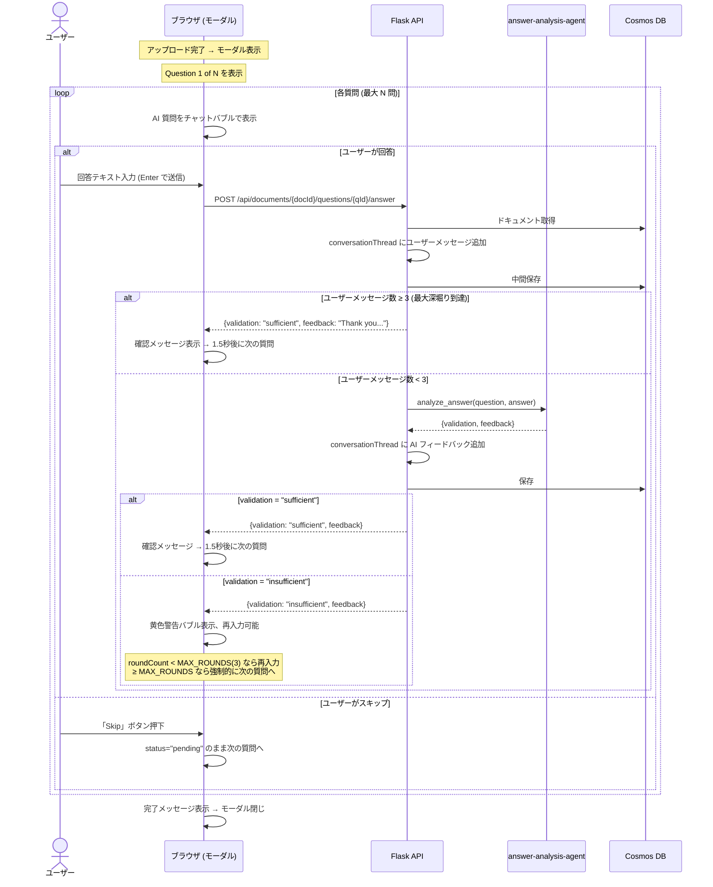

### 深堀り制限の二重チェック

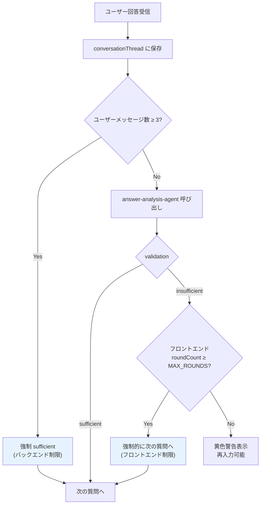

---

## 8. データフロー (Cosmos DB)

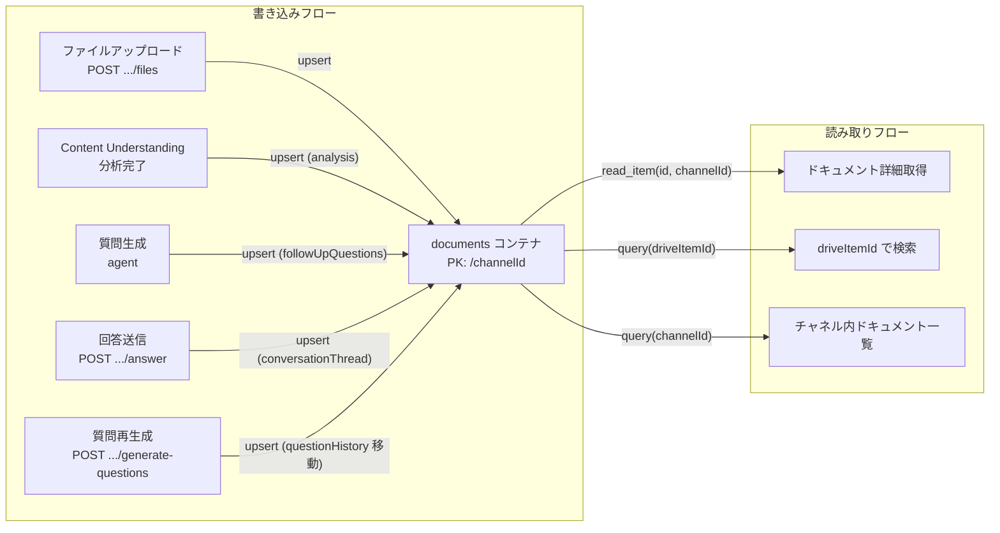

### Cosmos DB ドキュメントのライフサイクル

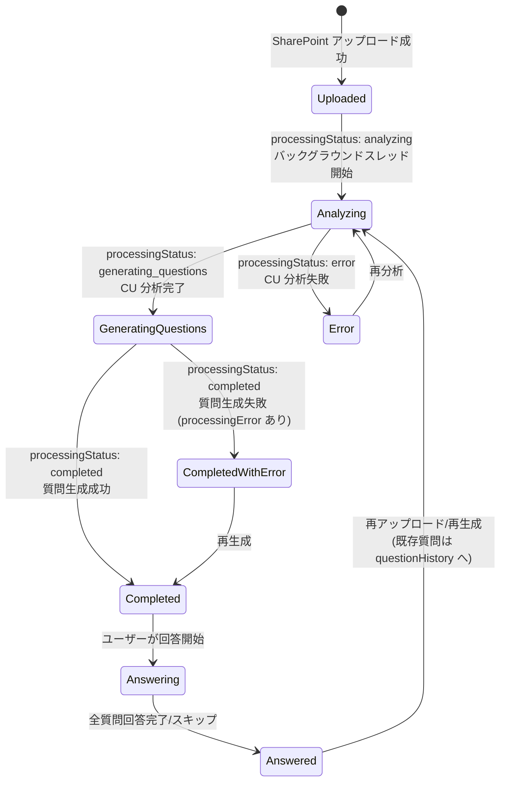

---

## 9. エージェント作成・デプロイフロー

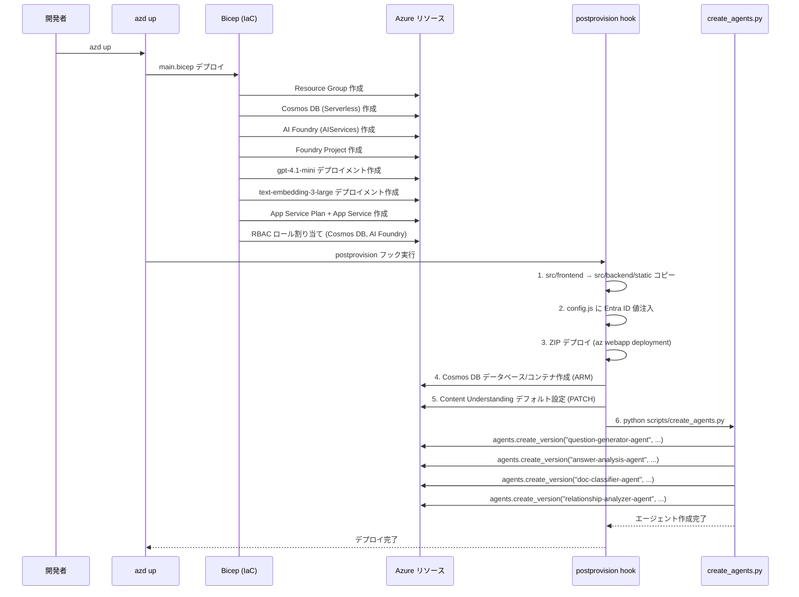

---

## 10. API エンドポイント — リクエスト/レスポンスフロー

```mermaid
flowchart LR
    subgraph "認証 API"
        ME["GET /api/me"]
    end

    subgraph "Teams API"
        CH["GET /api/teams/channels"]
        FILES["GET /api/teams/{tid}/channels/{cid}/files"]
        UPLOAD["POST /api/teams/{tid}/channels/{cid}/files"]
    end

    subgraph "Document API"
        DOC["GET /api/documents/{docId}"]
        GENQ["POST /api/documents/{docId}/generate-questions"]
        ANSQ["POST /api/documents/{docId}/questions/{qId}/answer"]
    end

    subgraph "外部サービス"
        GRAPH["Graph API"]
        COSMOS["Cosmos DB"]
        CU["Content Understanding"]
        AGENT["Foundry Agent"]
    end

    ME -->|"OBO → Graph"| GRAPH
    CH -->|"joinedTeams → channels"| GRAPH
    FILES -->|"filesFolder → children"| GRAPH
    FILES -->|"driveItemId 検索"| COSMOS
    UPLOAD -->|"PUT/Upload Session<br/>+ processingStatus: analyzing"| GRAPH
    UPLOAD -->|"upsert(初期ドキュメント)"| COSMOS
    Note over UPLOAD: HTTP 201 即座返却
    UPLOAD -.->|"バックグラウンドスレッド"| CU
    UPLOAD -.->|"バックグラウンドスレッド"| AGENT
    DOC -->|"get_drive_item"| GRAPH
    DOC -->|"get_document"| COSMOS
    GENQ -->|"generate_questions"| AGENT
    GENQ -->|"upsert_document"| COSMOS
    ANSQ -->|"analyze_answer"| AGENT
    ANSQ -->|"upsert_document"| COSMOS

    REL["GET /api/documents/{docId}/relationships"]
    REL -->|"関係情報取得"| COSMOS
    REL -->|"ファイル名/URL補完"| GRAPH
```

---

## 11. エラーハンドリングとリトライ

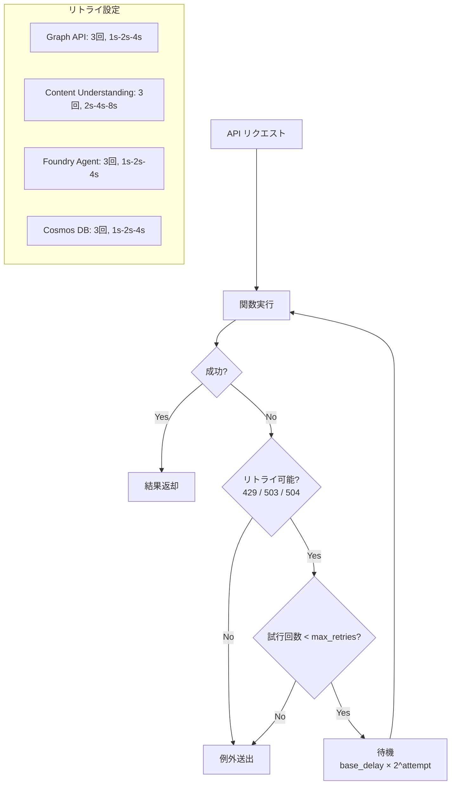

### 部分的完了 — 非同期処理の段階的保存

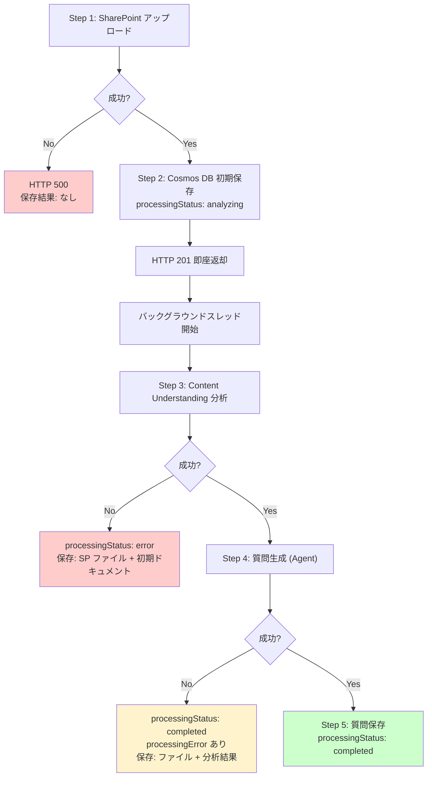

---

## 12. インフラストラクチャ構成

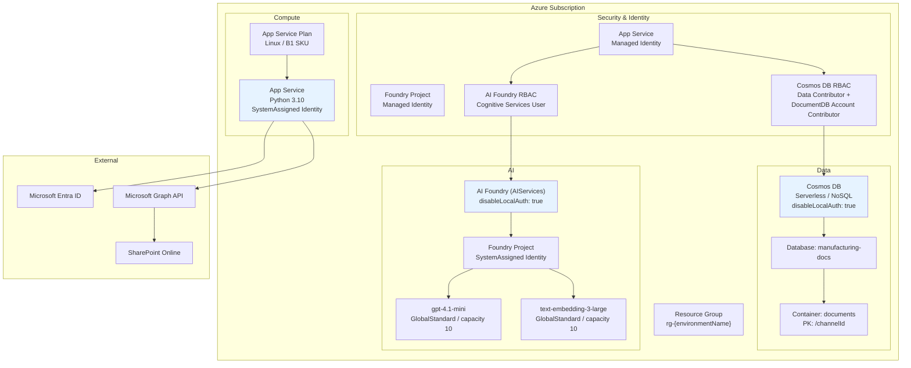

---

## 13. フロントエンド — コンポーネント構成

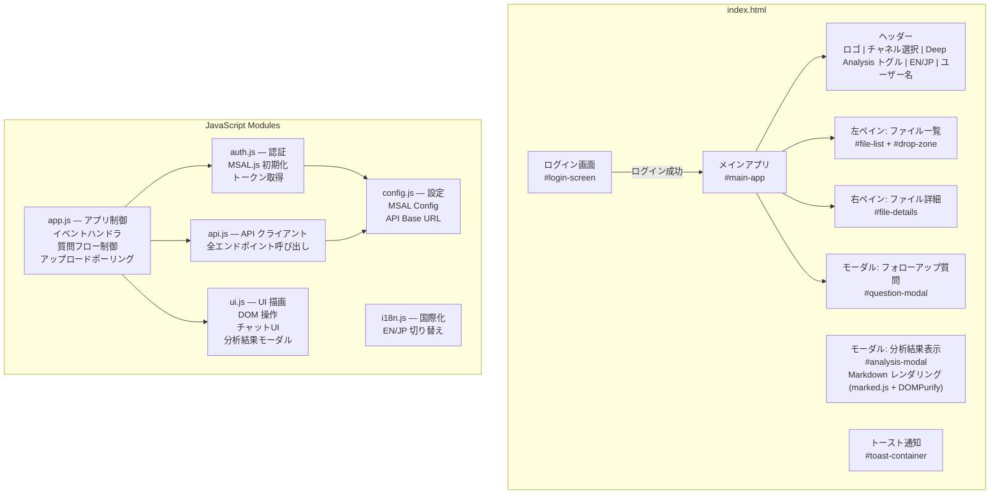

---

## 14. エンドツーエンド — ユーザー操作の完全フロー

```mermaid
flowchart TD
    A([ユーザーがアプリにアクセス]) --> B[MSAL.js でログイン<br/>Entra ID 認証]
    B --> C[GET /api/me でユーザー情報取得]
    C --> D[GET /api/teams/channels で<br/>チーム・チャネル一覧取得]
    D --> E[ユーザーがチャネル選択]
    E --> F[GET /api/teams/.../files で<br/>ファイル一覧取得]
    F --> G{ユーザーの操作}

    G -->|ファイル選択| H[GET /api/documents/{docId}<br/>詳細表示]
    H --> I[Graph API からメタデータ取得<br/>+ Cosmos DB から質問・回答取得]
    I --> J[右ペインに詳細表示<br/>会話スレッド全文表示]

    G -->|PDF ドロップ| K[POST /api/teams/.../files]
    K --> L[SharePoint アップロード]
    L --> L2[HTTP 201 即座返却<br/>processingStatus: analyzing]
    L2 --> L3[フロントエンド: 5秒間隔ポーリング]
    L3 -.-> M[バックグラウンド:<br/>Content Understanding 分析]
    M -.-> N[バックグラウンド:<br/>question-generator-agent<br/>約 5 問の質問生成]
    L3 -->|processingStatus: completed| O[フォローアップモーダル表示]
    O --> P{ユーザーの選択}

    P -->|回答入力| Q[POST /api/documents/.../answer]
    Q --> R[answer-analysis-agent<br/>回答分析]
    R --> S{判定結果}
    S -->|sufficient| T[次の質問へ]
    S -->|insufficient<br/>deep-dive < 3| U[補足要求表示<br/>再入力可能]
    U --> P
    S -->|insufficient<br/>deep-dive ≥ 3| T

    P -->|スキップ| T
    T --> V{全質問完了?}
    V -->|No| O
    V -->|Yes| W[完了メッセージ → モーダル閉じ]
    W --> F
```
