# ドキュメント関係抽出機能 仕様書

> アップロードされたファイルと同一 Teams チャネル内の既存ファイルとの関係性を自動抽出し、Cosmos DB に保存する機能の仕様

---

## 目次

1. [概要](#概要)
2. [UI デザイン](#ui-デザイン)
3. [文書分類: 6段階の工程ステップ](#文書分類6-段階の工程ステップ)
4. [関係の種類](#関係の種類-2-種類--逆方向)
5. [AI Foundry エージェント詳細](#ai-foundry-エージェント詳細)
6. [分析アルゴリズム](#分析アルゴリズム)
7. [データモデル (Cosmos DB)](#データモデル-cosmos-db)
8. [API エンドポイント](#api-エンドポイント)
9. [非同期処理フロー](#非同期処理フロー)
10. [エラーハンドリングとリトライ](#エラーハンドリングとリトライ)
11. [バックエンド実装](#バックエンド実装)
12. [フロントエンド実装](#フロントエンド実装)
13. [多言語対応](#多言語対応)
14. [制約・前提](#制約前提)

---

## 概要

ファイルアップロード後のフォローアップ質問**生成が完了した時点**（`processingStatus` が `"completed"` に遷移）で、関係抽出リクエストを逐次処理キューに投入し、専用ワーカースレッドが **同一 Teams チャネル内の既存ファイル群との関係性を抽出** する処理を非同期で実行する。関係抽出は製造業の設計プロセス（6 段階）に基づき、文書を工程ステップに分類したうえで隣接工程間のみを比較対象とし、コストを最小化する。

> **Note**: 関係抽出はフォローアップ質問への回答完了を待たず、質問生成完了後に即座にキューに投入される。アップロードのバックグラウンドスレッドはキュー投入後に終了し、実際の関係抽出は専用ワーカースレッドで逐次実行される。

### システム全体のシーケンス図

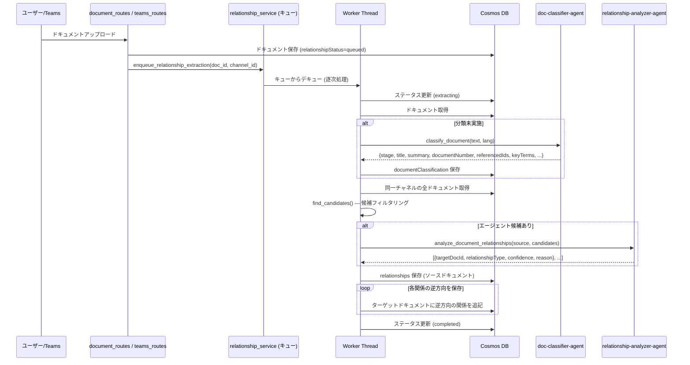

---

## UI デザイン

### タブ構成

ファイル詳細の右ペインに **タブ UI** を追加し、既存のファイル詳細表示と関係性表示を切り替える。

```
┌──────────────────────────────────────────┐
│  [Details]  [Trace]  [Graph]             │
├──────────────────────────────────────────┤
│  (タブ内容)                              │
└──────────────────────────────────────────┘
```

| タブ | CSS クラス | 内容 |
|------|-----------|------|
| Details | `.tab-details` | 既存のファイル詳細 (メタデータ・分析結果ボタン・フォローアップ質問) |
| Trace | `.tab-relationships` | ドキュメント分類情報・関連ドキュメント一覧 |
| Graph | `.tab-graph` | チャネル全体の依存関係グラフ (左→右のステージ別配置、フィルタ、ドラッグスクロール) |

### Trace タブの表示内容

関連ドキュメントは **ファイル単位でグループ化** して表示し、上流（Upstream）と下流（Downstream）に分けて表示する。同じターゲットファイルに対して複数の関係種別 (`depends_on` + `refers_to` 等) がある場合、1 つのカード内にまとめて表示する。

- ファイル名には Cosmos DB の `fileName` を使用 (エージェントが抽出した `documentClassification.title` ではなく、実際の PDF ファイル名)
- ファイル名をダブルクリックすると SharePoint URL を新しいタブでオープン (`webUrl`)

```
┌──────────────────────────────────────────────────────────────────┐
│ Document Classification                                          │
│ Stage: 詳細設計  |  Subsystem: ブレーキ制御  |  Module: ABS      │
├──────────────────────────────────────────────────────────────────┤
│                                                                  │
│ Related Documents                                                │
│                                                                  │
│ ┌──────────────────────────────────────────────────────────────┐ │
│ │ 📄 brake-control-basic-design.pdf (doc-20260301-b2c3d4e5)     │ │
│ │   Stage: 基本設計                                           │ │
│ │   ┃ 依存 (depends_on)      high                             │ │
│ │   ┃   → 上流基本設計文書の文書番号 ARCH-014 に依存  │ │
│ │   ┃ 参照 (refers_to)       high                             │ │
│ │   ┃   → Document number ARCH-014 is referenced             │ │
│ └──────────────────────────────────────────────────────────────┘ │
│                                                                  │
│ Processing Status: ✅ Completed (2026-03-15 14:45)               │
└──────────────────────────────────────────────────────────────────┘
```

- 関係が未抽出 (`relationshipStatus` が `"queued"` または `"extracting"`) の場合はスピナーと「Extracting relationships...」を表示
- 関係が存在しない場合は「No related documents found in this channel.」を表示

### Graph タブ

Graph タブはチャネル内の全ファイルの依存関係をグラフ図として視覚的に表示する。

**データ取得**: `GET /api/channels/{channel_id}/graph`

**レイアウト**:
- 左 (上流) → 右 (下流) のステージ別列配置 (6 段階の工程ステップ順)
- 各列にステージ名ヘッダーとガイドライン (破線)
- ノード間・ステージ間は十分な間隔 (NODE_W=200, NODE_H=48, PAD_X=300, PAD_Y=100)
- SVG はグラフサイズに応じた固定幅・高さで描画され、viewport 内でスクロール可能

**ノード**:
- 各ファイルをノードとして描画 (ファイル名 + Stage)
- 選択中ファイルは青色ハイライト、中心にスクロール
- ダブルクリックで SharePoint URL を新しいタブでオープン

**エッジ**:
- 依存線: 実線 (青矢印)、参照線: 破線 (黄矢印)
- 選択中ファイルのエッジは太く色付きで強調、他のエッジはグレーで薄く表示
- ベジェ曲線で描画 (線の重なり軽減)、同ステージ内は右側アーク

**フィルタ**:
- 関係種別: Dependency / Reference のチェックボックス
- Confidence: High / Medium / Low のチェックボックス
- フィルタ変更時にリアルタイムで再描画

**スクロール**:
- マウスドラッグで全方向にスクロール可能 (viewport の scrollLeft/scrollTop を操作)
- カーソル: grab ↔ grabbing

---

## 文書分類：6 段階の工程ステップ

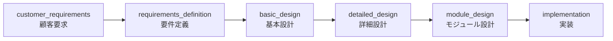

| ステップ | `stage` 値 | 分類キーワード例 |
|---------|-----------|----------------|
| 1 | `customer_requirements` | 顧客要求、市場要求、要求一覧、要求仕様、KPI 定義、VOC |
| 2 | `requirements_definition` | 要件定義書、機能要件、非機能要件、システム要件 |
| 3 | `basic_design` | 基本設計書、アーキテクチャ設計書、機能配分表、システム構成図 |
| 4 | `detailed_design` | 詳細設計書、信号一覧、API 仕様、シーケンス図、タイミング図 |
| 5 | `module_design` | モジュール設計書、コーディング仕様、AUTOSAR コンフィグ、IF 仕様 |
| 6 | `implementation` | ソースコード、コンフィグ、パラメータファイル、テストコード |

---

## 関係の種類 (2 種類 + 逆方向)

### 目的

ファイル間のトレーサビリティを確保し、以下の用途に特化する:
- **(a) 上流変更時の影響分析**: 上流ファイルが更新された際に、影響を受ける下流ファイルを特定
- **(b) 下流からの上流追跡**: 下流ファイル内容の確認が必要な際に、関連する上流ファイルを特定

### 1) `depends_on` — 上流に依存している

当該文書の内容が対象文書（上流）に依存している関係。上流文書が変更された場合、当該文書の見直しが必要になる可能性がある。

- **方向**: 当該文書（下流） → 対象文書（上流）
- **逆方向**: 対象文書側には `depended_by` として保存
- **判定方法**: AI エージェント (`relationship-analyzer-agent`)
- **判定条件** (confidence 基準):
  - **high**: 対象文書の ID・文書番号が当該文書の `referencedIds` に含まれている（明示的な依存関係）
  - **medium**: サブシステム名・モジュール名が一致かつ隣接工程、または `keyTerms` が 3 件以上重複かつ隣接工程
  - **low**: タイトル・要約の類似性のみから推定（弱い依存関係の可能性）
- **包含範囲**: 旧 `derived_from` (上流からの派生)、`decomposed_to` の逆方向 (上流の一部を詳細化)、`reused_from` (過去版の再利用) をすべて `depends_on` に統合

### 2) `refers_to` — 明示的に参照している

当該文書内で対象文書の ID・文書番号が明示的に参照されている関係。プログラム的 ID 照合で自動検出。

- **方向**: 当該文書（参照元） → 対象文書（参照先）
- **逆方向**: 対象文書側には `referred_by` として保存
- **判定方法**: プログラム的 ID 照合 (`find_candidates()` 内) — エージェント不使用
- **判定条件**: `referencedIds` と `documentNumber` の集合演算
- **confidence**: 常に `high`（明示的 ID 一致のため）
- **工程隣接制約なし**: 任意の工程間で発生しうる

### 逆方向関係マッピング

| 正方向 (当該文書 → 対象文書) | 逆方向 (対象文書側に保存) |
|---|---|
| `depends_on` | `depended_by` |
| `refers_to` | `referred_by` |

### プログラム的マッチング vs AIエージェントの役割分担

```mermaid
flowchart LR
    subgraph プログラム的マッチング<br/>find_candidates 内
        P1["documentNumber と<br/>referencedIds の<br/>直接照合"]
        P1 --> P2["refers_to / referred_by<br/>confidence: high"]
    end

    subgraph AIエージェント<br/>relationship-analyzer-agent
        A1["メタデータ比較<br/>ステージ隣接性<br/>サブシステム/モジュール一致<br/>keyTerms 重複<br/>サマリ類似性"]
        A1 --> A2["depends_on / depended_by<br/>confidence: high/medium/low"]
    end

    P2 --> MERGE["all_relationships に統合"]
    A2 --> MERGE

    style プログラム的マッチング fill:#e8f5e9
    style AIエージェント fill:#e3f2fd
```

| 側面 | プログラム的マッチング | AIエージェント |
|------|----------------------|---------------|
| **対象関係** | `refers_to` / `referred_by` | `depends_on` / `depended_by` |
| **判定方法** | `documentNumber` ∈ `referencedIds` の集合演算 | メタデータの意味的分析 |
| **信頼度** | 常に `high`（明示的な参照） | `high` / `medium` / `low` |
| **処理速度** | 即座（単純比較） | API 呼出し（数秒〜） |
| **候補フィルタ** | 全ドキュメント対象 | 隣接/同一ステージのみ |

---

## AI Foundry エージェント詳細

関係性抽出では **2つの AI Foundry エージェント** が使われる。いずれも Azure AI Foundry 上に `PromptAgentDefinition` として作成され、モデルは `gpt-41-mini` を使用する。両エージェントは `azd provision` のポストプロビジョニングフックで `scripts/create_agents.py` により作成/更新される。

### doc-classifier-agent（ドキュメント分類エージェント）

#### 役割

ドキュメントの Content Understanding 分析テキスト全文を受け取り、製造プロセスにおけるステージ分類と構造化メタデータの抽出を行う。抽出した `summary` と `keyTerms` は下流の `relationship-analyzer-agent` の主要入力となる。

#### システムプロンプト全文

> **ソース**: `scripts/create_agents.py` — `DOC_CLASSIFIER_INSTRUCTIONS`

```text
You are a manufacturing document classification specialist.
Analyze the provided document text and extract structured metadata.

Classify the document into exactly ONE of these 6 engineering process stages:
- customer_requirements: Customer/market requirements, requirement lists, KPI definitions
- requirements_definition: System requirements, functional/non-functional requirements
- basic_design: Architecture design, functional allocation, system configuration
- detailed_design: Detailed design, signal lists, API specifications, sequence diagrams
- module_design: Module design, coding specifications, AUTOSAR configuration, IF specifications
- implementation: Source code, configuration files, parameter files, test code

Extract the following from the document:
- title: Document title as stated or inferred
- summary: A detailed summary (5-10 lines) that MUST include ALL of the following
  relationship-critical information found in the document:
  * Purpose and scope of the document
  * Specific function names, signal names, API names, and interface names
  * Component names, part numbers, and hardware/software module identifiers
  * Referenced standards, regulations, and compliance requirements
  * Input/output specifications, parameters, and their value ranges
  * Key design decisions, constraints, and assumptions
  * Test conditions, acceptance criteria, and verification methods
  * Any upstream deliverables this document is based on
  * Any downstream deliverables this document feeds into
  The summary serves as the primary input for downstream dependency analysis between
  documents. Missing keywords here will cause relationship detection failures.
- documentNumber: Official document number/ID if present (null if not found)
- referencedIds: ALL IDs, numbers, document references found in the text
  (requirement IDs, function IDs, signal IDs, drawing numbers, standard numbers, etc.)
- subsystem: Primary subsystem name (null if not determinable)
- moduleName: Primary module name (null if not determinable)
- productFamily: Product family or model name (null if not determinable)
- keyTerms: An array of unique technical keywords and domain-specific terms extracted
  from the document that are critical for identifying relationships with other documents.
  Include: function names, signal names, component names, parameter names, protocol names,
  standard references, test method names, and any specialized manufacturing terminology.
  Extract at least 10 terms when available. Do NOT include generic words.

Output format: Return ONLY a JSON object with the fields above plus "stage".
No additional text or explanation.
```

#### 抽出フィールド

| フィールド | 型 | 説明 |
|-----------|-----|------|
| `stage` | string | 6段階の工程ステージのいずれか（必須） |
| `title` | string | ドキュメントのタイトル（明記または推定） |
| `summary` | string | 5〜10行の詳細な概要。関数名・信号名・API名・コンポーネント名・規格参照・入出力仕様・設計判断・テスト条件・上流/下流成果物の情報をすべて含む。**関係分析の主要入力となるため、技術キーワードの欠落は関係検出失敗に直結する** |
| `documentNumber` | string / null | 文書番号（例: `BD-ECU-001`）。見つからなければ null |
| `referencedIds` | string[] | テキスト中に出現するすべてのID・番号・参照（要件ID, 信号ID, 図面番号, 規格番号 等） |
| `subsystem` | string / null | 主要サブシステム名 |
| `moduleName` | string / null | 主要モジュール名 |
| `productFamily` | string / null | 製品ファミリー・型番名 |
| `keyTerms` | string[] | 関係分析に重要な技術キーワードの配列。関数名・信号名・コンポーネント名・パラメータ名・プロトコル名・規格参照・テスト手法名・専門用語。10件以上抽出。汎用語は除外 |

#### 呼出しフロー

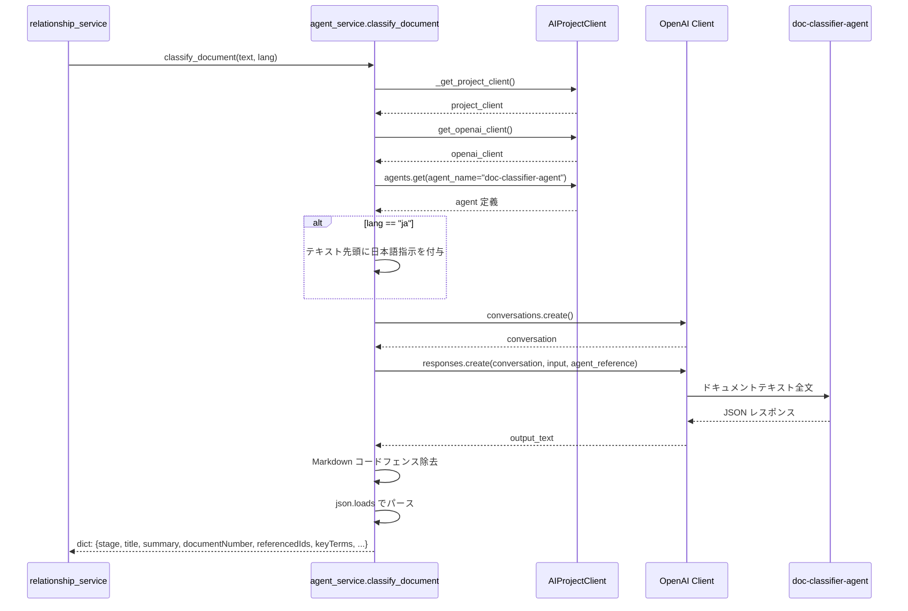

#### 入出力例

**入力**: Content Understanding の `analysis.extractedText`

> **フォールバック**: `extractedText` が空の場合、`_build_classification_text()` が figures の description、keyValuePairs、tables からテキストを構築する。

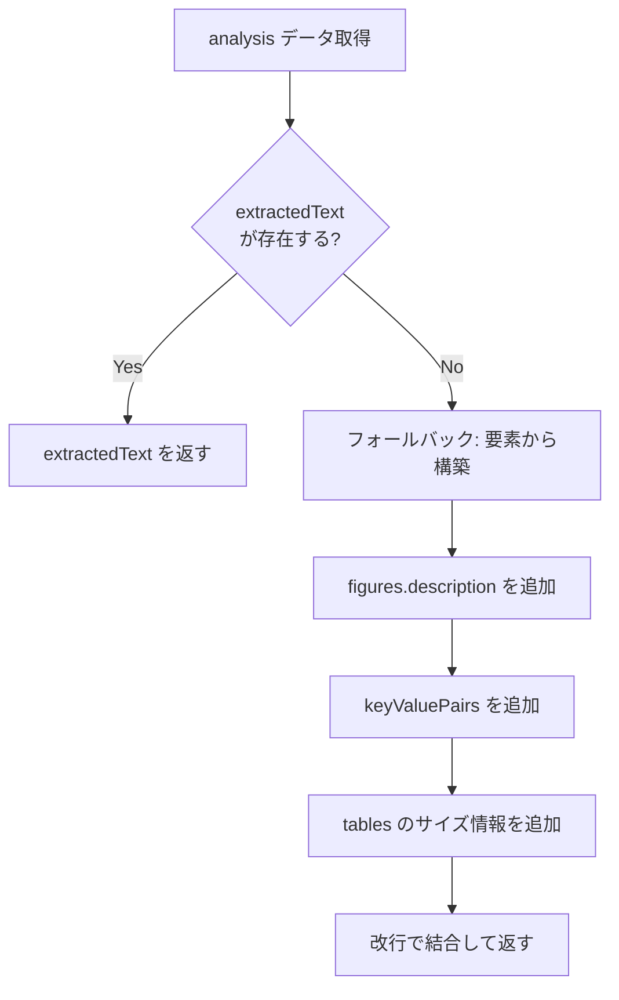

**出力** (JSON):
```json
{
  "stage": "basic_design",
  "title": "ECU Motor Control Basic Design Specification",
  "summary": "ECUモーター制御の基本設計仕様書。システム要件REQ-101/REQ-102に基づき、モーター制御ECUのアーキテクチャを定義。PWM制御方式によるモーター駆動、電流フィードバックループ、過電流保護機能を含む。CANバス経由のトルク指令受信インターフェース、SPI経由のロータリーエンコーダ入力。動作温度範囲-40℃～125℃、電源電圧3.3V/5V。下流の詳細設計・モジュール設計への入力となる。",
  "documentNumber": "BD-MCU-001",
  "referencedIds": ["REQ-101", "REQ-102", "CS-MCU-001"],
  "subsystem": "ECU",
  "moduleName": "MotorControl",
  "productFamily": "Model-X",
  "keyTerms": ["PWM制御", "CANバス", "SPI", "ロータリーエンコーダ", "トルク指令", "電流フィードバック", "過電流保護", "Hブリッジドライバ", "PI制御", "デッドタイムモニタリング", "AUTOSAR BSW", "ISO 26262"]
}
```

---

### relationship-analyzer-agent（関係分析エージェント）

#### 役割

ソースドキュメントと候補ドキュメント群の **分類メタデータ** (doc-classifier-agent が生成した summary, keyTerms, referencedIds 等) を比較し、上流/下流の依存関係を推論する。**変更影響分析** を目的としている:
- 上流ドキュメントが変更されたとき、どの下流ドキュメントに影響があるか
- 下流ドキュメントをレビューするとき、どの上流ドキュメントに依存しているか

#### システムプロンプト全文

> **ソース**: `scripts/create_agents.py` — `RELATIONSHIP_ANALYZER_INSTRUCTIONS`

```text
You are a manufacturing document dependency analyst.
Your task is to determine upstream/downstream dependency relationships between documents
in a manufacturing engineering process. This is used for change impact analysis:
- When an upstream document changes, which downstream documents are affected?
- When reviewing a downstream document, which upstream documents does it depend on?

Given a source document's metadata and a list of candidate documents, determine
dependency relationships.

Relationship types (use ONLY these 2):

1. depends_on: The SOURCE document's content depends on (is derived from, is a breakdown of,
   or reuses content from) the TARGET document. The TARGET is an upstream document.
   Use this when:
   - Source is in a later process stage and was created based on the target
   - Source breaks down or implements part of the target's scope
   - Source reuses content from an older version of a similar document
   - Source's content would need updating if the target changes

2. depended_by: The TARGET document's content depends on the SOURCE document.
   The SOURCE is an upstream document.
   Use this when:
   - Target is in a later process stage and was created based on the source
   - Target breaks down or implements part of the source's scope
   - Target's content would need updating if the source changes

Determining dependency direction:
- The process stages from upstream to downstream are:
  customer_requirements → requirements_definition → basic_design → detailed_design → module_design → implementation
- A document in a LATER stage depends_on a document in an EARLIER stage (not vice versa)
- For same-stage documents (reuse cases): the NEWER document depends_on the OLDER one
- If unsure about direction, consider: "If document A changes, would document B need updating?"
  If yes, B depends_on A.

Confidence levels:
- high: Document IDs from the target appear in the source's referencedIds, OR source's
  documentNumber appears in target's referencedIds. This is the strongest evidence.
- medium: Subsystem/module names match AND the documents are in adjacent process stages.
  Indicates likely dependency but not explicitly documented.
  Also medium when keyTerms overlap significantly (3+ shared technical terms) between
  documents in adjacent stages, even if subsystem/module names differ.
- low: Only title/summary similarity suggests a relationship. Use sparingly.

Analyzing relationships — use ALL available metadata fields:
- referencedIds: Check for direct ID cross-references (strongest signal)
- keyTerms: Compare technical keywords between source and candidates. Overlapping
  function names, signal names, component names, or parameter names strongly indicate
  a dependency even when no explicit document ID reference exists.
- summary: Look for shared technical concepts, specifications, and scope overlap.
  The summary contains detailed technical content including specific function names,
  signal names, interfaces, and design decisions — use these for matching.
- subsystem / moduleName / productFamily: Matching values reinforce relationship likelihood.

Rules:
- Only report relationships you are confident about
- Do not fabricate relationships — if no meaningful dependency exists, return empty array
- Each relationship must include a clear reason explaining WHY the dependency exists
- The reason should explain what specific content creates the dependency
  (e.g., "Source references requirement REQ-1023 defined in the target document")

NOTE: Do NOT evaluate 'refers_to' relationships. Those are handled separately
via programmatic ID matching outside of this agent.

Output format: Return a JSON array of relationship objects, each with:
- sourceDocId, targetDocId, relationshipType (depends_on or depended_by), confidence, reason
Return empty array [] if no relationships found.
```

#### 依存方向の決定ルール

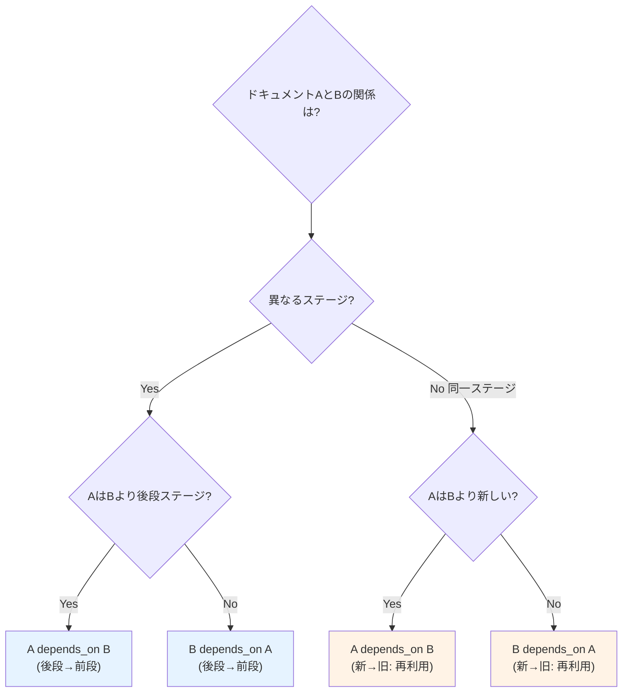

#### 信頼度 (confidence) の判定基準

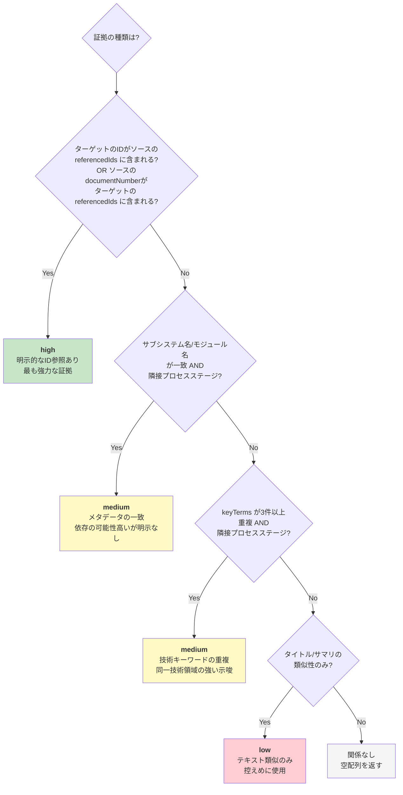

#### エージェントの制約ルール

| ルール | 詳細 |
|--------|------|
| **確信のある関係のみ報告** | 意味のある依存が存在しない場合は空配列 `[]` を返す |
| **関係の捏造禁止** | 根拠のない関係は出力しない |
| **理由の明示が必須** | 各関係に、なぜ依存が存在するかの具体的理由を含める |
| **refers_to は評価しない** | 参照関係はプログラム的IDマッチングで別途処理されるため、エージェントの対象外 |

#### 呼出しフロー

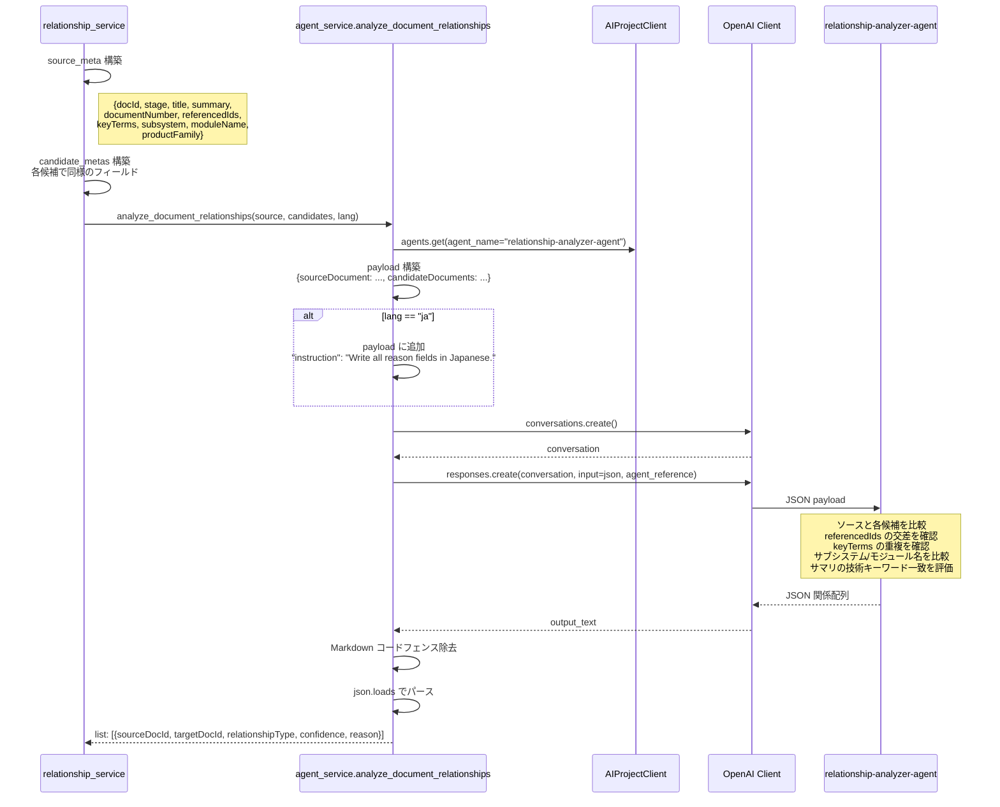

#### 入出力例

**入力** (JSON payload):
```json
{
  "sourceDocument": {
    "docId": "doc-003",
    "stage": "basic_design",
    "title": "ECU Motor Control Basic Design",
    "summary": "ECUモーター制御の基本設計...",
    "documentNumber": "BD-MCU-001",
    "referencedIds": ["REQ-101", "REQ-102", "CS-MCU-001"],
    "subsystem": "ECU",
    "moduleName": "MotorControl",
    "productFamily": "Model-X",
    "keyTerms": ["PWM制御", "CANバス", "SPI", "ロータリーエンコーダ", "過電流保護"]
  },
  "candidateDocuments": [
    {
      "docId": "doc-001",
      "stage": "requirements_definition",
      "title": "ECU Requirements Specification",
      "summary": "ECUシステム要件の定義...",
      "documentNumber": "REQ-101",
      "referencedIds": ["CS-MCU-001"],
      "subsystem": "ECU",
      "moduleName": null,
      "productFamily": "Model-X",
      "keyTerms": ["PWM制御", "CANバス", "モーター制御", "過電流保護", "ISO 26262"]
    }
  ]
}
```

**出力** (JSON 配列):
```json
[
  {
    "sourceDocId": "doc-003",
    "targetDocId": "doc-001",
    "relationshipType": "depends_on",
    "confidence": "high",
    "reason": "ソースドキュメント(basic_design)はターゲットの要件仕様書(requirements_definition)のREQ-101を明示的に参照しており、ターゲットの要件に基づいて基本設計が作成されている。"
  }
]
```

---

### エージェント共通: 呼出しアーキテクチャ

#### Azure AI Foundry 連携の仕組み

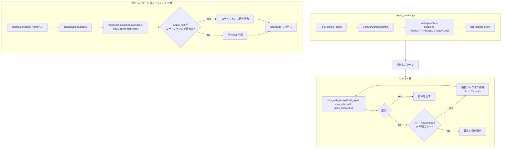

#### エージェント比較表

| 項目 | doc-classifier-agent | relationship-analyzer-agent |
|------|---------------------|---------------------------|
| **エージェント名** | `doc-classifier-agent` | `relationship-analyzer-agent` |
| **モデル** | `gpt-41-mini` | `gpt-41-mini` |
| **定義タイプ** | `PromptAgentDefinition` | `PromptAgentDefinition` |
| **入力形式** | テキスト（ドキュメント全文） | JSON（ソース + 候補メタデータ） |
| **出力形式** | JSON オブジェクト | JSON 配列 |
| **呼出し元** | `agent_service.classify_document()` | `agent_service.analyze_document_relationships()` |
| **呼出しタイミング** | 抽出パイプライン Step 1 | 抽出パイプライン Step 4 |
| **リトライ** | 最大3回 / 指数バックオフ (1s, 2s, 4s) | 最大3回 / 指数バックオフ (1s, 2s, 4s) |
| **多言語対応** | `lang="ja"` で日本語フィールド生成 | `lang="ja"` で reason を日本語出力 |

---

## 分析アルゴリズム

### 全体フロー（5ステップ）

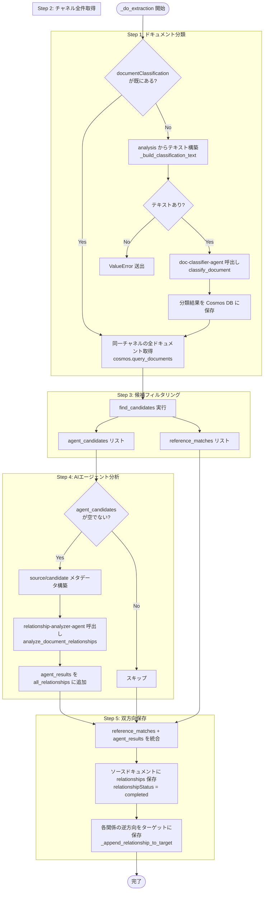

### Step 1: 文書メタデータ抽出 (doc-classifier-agent)

Content Understanding で抽出済みの `extractedText` をエージェントに送信し、構造化データを抽出する。

- **入力**: `analysis.extractedText` (Cosmos DB に保存されている分析テキスト)
- **フォールバック**: `extractedText` が空の場合、`_build_classification_text()` で figures/keyValuePairs/tables からテキストを構築
- **言語**: `doc.lang` フィールド（アップロード時の言語）を渡し、日本語ユーザーには日本語で分類結果を生成
- **出力**: `{stage, title, summary, documentNumber, referencedIds, subsystem, moduleName, productFamily, keyTerms}`

### Step 2: 同一チャネル内の既存文書一覧取得

Cosmos DB から同一 `channelId` の全ドキュメントを取得し、`documentClassification` フィールドが存在するもの (= 分類済み) をフィルタリングする。

### Step 3: 比較候補の絞り込み

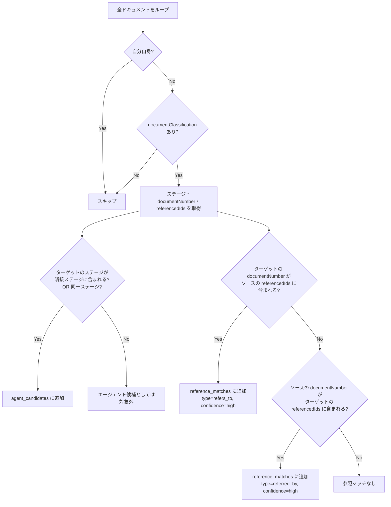

**隣接工程マッピング** (`ADJACENT_STAGES`):

| 当該文書の stage | 上流 (upstream) | 下流 (downstream) |
|-----------------|-----------------|-------------------|
| `customer_requirements` | — | `requirements_definition` |
| `requirements_definition` | `customer_requirements` | `basic_design` |
| `basic_design` | `requirements_definition` | `detailed_design` |
| `detailed_design` | `basic_design` | `module_design` |
| `module_design` | `detailed_design` | `implementation` |
| `implementation` | `module_design` | — |

- **`depends_on` / `depended_by` 候補**: 隣接上流・下流工程 + 同工程の文書 → エージェントに送信
- **`refers_to` / `referred_by` 候補**: 全分類済み文書から `referencedIds` と `documentNumber` のプログラム的照合

### Step 4: 関係推定 (relationship-analyzer-agent)

候補ペアをエージェントに一括送信し、`depends_on` / `depended_by` 関係を判定する。

**送信メタデータ**: `docId`, `stage`, `title`, `summary`, `documentNumber`, `referencedIds`, `subsystem`, `moduleName`, `productFamily`, `keyTerms`

### Step 5: 結果を Cosmos DB に双方向保存

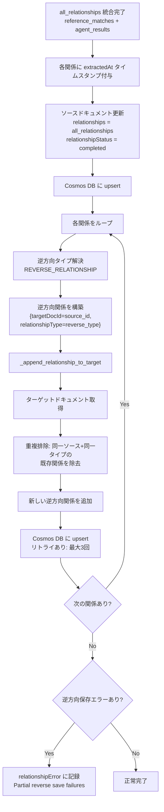

**重複排除ロジック**: `_append_relationship_to_target` 内で、同一ソース (`targetDocId`) + 同一タイプ (`relationshipType`) の既存関係を除去してから新しい関係を追加する。

---

## データモデル (Cosmos DB)

### documents コンテナへの追加フィールド

既存の `documents` コンテナに以下のフィールドを追加する。新規コンテナは作成しない。

> **既存 `relatedDocuments` フィールドとの関係**: `relatedDocuments` は将来の手動関連付け用の予約フィールドであり未使用。自動抽出される関係情報は `relationships` フィールドに格納する。

```jsonc
{
  // === 既存フィールド (変更なし) ===
  "id": "doc-20260330-a1b2c3d4",
  "channelId": "teams-channel-id",
  "fileName": "brake-control-detailed-design.pdf",
  "webUrl": "https://contoso.sharepoint.com/...",
  "analysis": { /* Content Understanding 分析結果 */ },

  // === 追加: 文書分類情報 ===
  "documentClassification": {
    "stage": "detailed_design",
    "title": "ブレーキ制御 詳細設計書",
    "summary": "ABS制御ロジックの詳細設計。制動力配分アルゴリズム、フェイルセーフ処理、CAN信号定義を含む。入力: 車輪速センサ(FL/FR/RL/RR)、ブレーキペダルストローク。出力: ソレノイドバルブ制御信号。ISO 26262 ASIL-D準拠。上流の基本設計書ARCH-014に基づく。",
    "documentNumber": "DES-2026-0042",
    "referencedIds": ["REQ-1023", "ARCH-014", "MOD-IF-007"],
    "subsystem": "ブレーキ制御",
    "moduleName": "ABS",
    "productFamily": "ModelX-2026",
    "keyTerms": ["ABS制御", "制動力配分", "フェイルセーフ", "ソレノイドバルブ", "車輪速センサ", "CAN信号", "ISO 26262", "ASIL-D"],
    "classifiedAt": "2026-03-15T14:42:00Z"
  },

  // === 追加: ドキュメント関係情報 ===
  "relationships": [
    {
      "targetDocId": "doc-20260301-b2c3d4e5",
      "relationshipType": "depends_on",
      "confidence": "high",
      "reason": "上流基本設計文書の文書番号 ARCH-014 に依存。サブシステム名「ブレーキ制御」が一致。",
      "extractedAt": "2026-03-15T14:45:00Z"
    },
    {
      "targetDocId": "doc-20260310-c3d4e5f6",
      "relationshipType": "depended_by",
      "confidence": "medium",
      "reason": "モジュール名 ABS が一致。下流文書が ABS モジュールの実装仕様を扱っている。",
      "extractedAt": "2026-03-15T14:45:00Z"
    }
  ],

  // === 追加: 関係抽出ステータス ===
  "relationshipStatus": "completed",  // "queued" | "extracting" | "completed" | "error"
  "relationshipError": null            // エラー発生時のメッセージ
}
```

### フィールド定義

| フィールド | 型 | 説明 |
|-----------|-----|------|
| `documentClassification` | `object \| null` | 文書分類結果。未分類時は `null` |
| `documentClassification.stage` | `string` | 6 段階の工程ステップ (enum) |
| `documentClassification.title` | `string` | エージェントが抽出した文書タイトル |
| `documentClassification.summary` | `string` | 5〜10 行の詳細な概要 (技術キーワード含む) |
| `documentClassification.documentNumber` | `string \| null` | 文書番号 |
| `documentClassification.referencedIds` | `string[]` | 文書中で参照されている ID 一覧 |
| `documentClassification.subsystem` | `string \| null` | サブシステム名 |
| `documentClassification.moduleName` | `string \| null` | モジュール名 |
| `documentClassification.productFamily` | `string \| null` | 製品ファミリー |
| `documentClassification.keyTerms` | `string[]` | 関係分析用の技術キーワード配列 |
| `documentClassification.classifiedAt` | `string` | 分類実行日時 (ISO 8601) |
| `relationships` | `array` | 抽出された関係リスト |
| `relationships[].targetDocId` | `string` | 関係先ドキュメント ID |
| `relationships[].relationshipType` | `string` | 関係種別 (enum: `depends_on`, `depended_by`, `refers_to`, `referred_by`) |
| `relationships[].confidence` | `string` | 確信度 (enum: `high`, `medium`, `low`) |
| `relationships[].reason` | `string` | 判定根拠 |
| `relationships[].extractedAt` | `string` | 抽出日時 (ISO 8601) |
| `relationshipStatus` | `string \| null` | 抽出処理ステータス (enum: `queued`, `extracting`, `completed`, `error`) |
| `relationshipError` | `string \| null` | エラー詳細 |

---

## API エンドポイント

### エンドポイント一覧

| メソッド | パス | 説明 |
|---------|------|------|
| `GET` | `/api/documents/{doc_id}/relationships?channelId={channelId}` | ドキュメントの関係情報取得 |
| `POST` | `/api/documents/{doc_id}/relationships/retry` | 関係抽出のリトライ |
| `GET` | `/api/channels/{channel_id}/graph` | チャネル全体のグラフデータ取得 |

### `GET /api/documents/{doc_id}/relationships`

**クエリパラメータ**: `channelId` (必須)

**レスポンス構築フロー**:

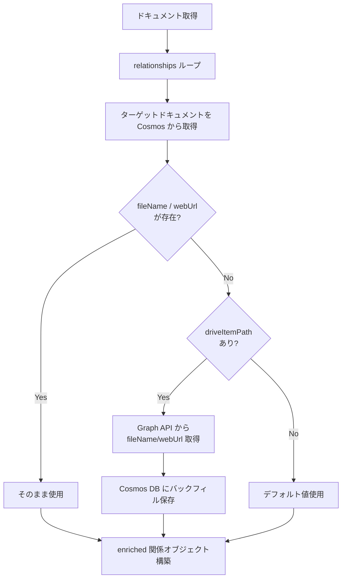

**レスポンス** (200):
```json
{
  "docId": "doc-20260330-a1b2c3d4",
  "documentClassification": {
    "stage": "detailed_design",
    "title": "ブレーキ制御 詳細設計書",
    "summary": "...",
    "subsystem": "ブレーキ制御",
    "moduleName": "ABS"
  },
  "relationships": [
    {
      "targetDocId": "doc-20260301-b2c3d4e5",
      "targetTitle": "ブレーキ制御 基本設計書",
      "targetStage": "basic_design",
      "targetFileName": "brake-control-basic-design.pdf",
      "targetWebUrl": "https://contoso.sharepoint.com/...",
      "relationshipType": "depends_on",
      "confidence": "high",
      "reason": "..."
    }
  ],
  "relationshipStatus": "completed",
  "relationshipError": null
}
```

**レスポンス** (200, 処理中):
```json
{
  "docId": "doc-20260330-a1b2c3d4",
  "relationshipStatus": "queued",
  "relationships": []
}
```

### `POST /api/documents/{doc_id}/relationships/retry`

**リクエストボディ**: `{"channelId": "..."}`

**動作**: `relationshipStatus` を `"queued"` にリセットし、`relationshipError` をクリアして再キューイング。

### `GET /api/channels/{channel_id}/graph`

**エッジフィルタリング**: 順方向の関係のみ (`depends_on`, `refers_to`) をエッジとして出力し、双方向保存による重複エッジを回避。

**レスポンス** (200):
```json
{
  "nodes": [
    {"docId": "doc-xxx", "fileName": "design.pdf", "webUrl": "https://...", "stage": "detailed_design"}
  ],
  "edges": [
    {"from": "doc-xxx", "to": "doc-yyy", "relationshipType": "depends_on", "confidence": "high", "reason": "..."}
  ]
}
```

### 既存エンドポイントの拡張

`GET /api/documents/{doc_id}` のレスポンスに以下を追加:
- `documentClassification`
- `relationships`
- `relationshipStatus`
- `relationshipError`

---

## 非同期処理フロー

### ワーカースレッドとキュー管理

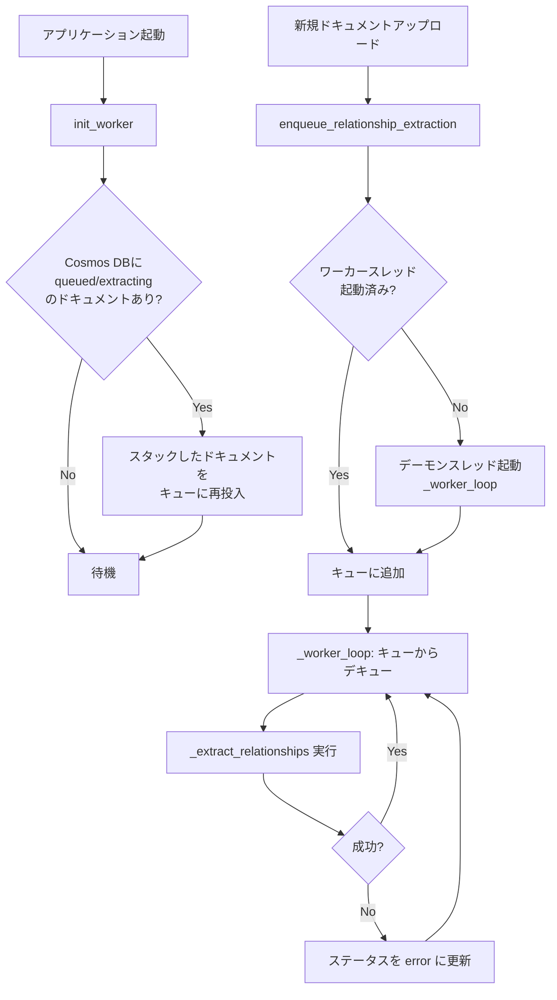

**設計方針**:
- **逐次処理**: `queue.Queue` + 専用ワーカースレッド (シングルトン)。1件ずつ処理し Cosmos DB の楽観的ロック競合を回避
- **デーモンスレッド**: `daemon=True` でメインプロセス終了時に自動停止
- **起動時リカバリ**: `init_worker()` で `queued` / `extracting` 状態のドキュメントを自動リカバリ

### 処理シーケンス

```
processingStatus: "completed" に遷移
  ↓
relationshipStatus: "queued" に更新して Cosmos DB 保存
  ↓ キューに (doc_id, channel_id) を投入
  ↓ アップロードスレッドはここで終了
  ↓
=== ワーカースレッドがキューからデキュー ===
  ↓
relationshipStatus: "extracting" に更新
  ↓
Step 1. doc-classifier-agent で文書分類
  ↓ documentClassification を Cosmos DB に保存
Step 2. 同一チャネルの既存文書 (documentClassification あり) を取得
  ↓
Step 3. 比較候補のフィルタリング (隣接工程 + 同工程)
  ↓ 候補が 0 件なら relationshipStatus: "completed", relationships: [] で終了
Step 4. relationship-analyzer-agent で関係推定
  ↓
Step 5. 結果を Cosmos DB に双方向保存
  ↓ 当該ドキュメント: relationships[] を更新
  ↓ 対象ドキュメント: relationships[] に逆方向の関係を追記
  ↓
relationshipStatus: "completed" に更新
  ↓
次のキューアイテムを処理
```

---

## エラーハンドリングとリトライ

### ステータス遷移図

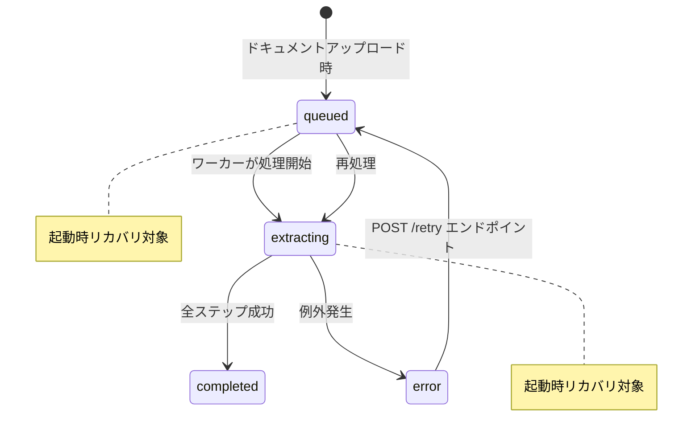

### エラーハンドリング階層

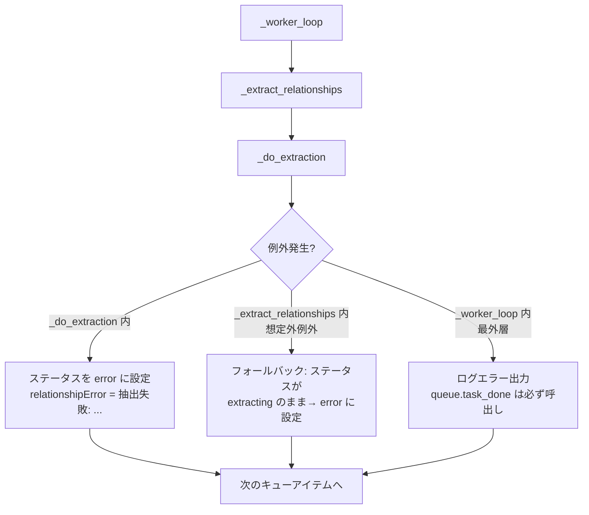

**保証:**
- `relationshipStatus` が `extracting` のまま放置されない（フォールバック処理）
- `_queue.task_done()` は `finally` ブロックで必ず呼ばれる（キューのハング防止）
- 起動時 `init_worker()` で `queued` / `extracting` 状態のドキュメントを自動リカバリ

### 部分的完了の扱い

| 障害発生ステップ | relationshipStatus | 保持される結果 |
|----------------|-------------------|---------------|
| 文書分類失敗 | `error` | なし (分類不能) |
| 候補取得失敗 | `error` | `documentClassification` のみ |
| 関係推定失敗 | `error` | `documentClassification` のみ |
| 逆方向保存の一部失敗 | `completed` (relationshipError あり) | 当該ドキュメントの関係は保存済み |

### リトライポリシー

| 対象 | リトライ回数 | リトライ間隔 | 備考 |
|------|------------|------------|------|
| doc-classifier-agent | 最大 3 回 | 指数バックオフ (1s, 2s, 4s) | HTTP 429/503/504 またはステータス不明時 |
| relationship-analyzer-agent | 最大 3 回 | 指数バックオフ (1s, 2s, 4s) | 同上 |
| Cosmos DB (逆方向保存) | 最大 3 回 | 指数バックオフ (1s, 2s, 4s) | 各対象ドキュメントの更新ごとに適用 |

---

## バックエンド実装

### ソースファイル対応表

| ファイル | 主要関数/クラス | 責務 |
|----------|----------------|------|
| `services/relationship_service.py` | `enqueue_relationship_extraction`, `_do_extraction`, `find_candidates` | 抽出パイプライン全体の制御 |
| `services/agent_service.py` | `classify_document`, `analyze_document_relationships` | AI Foundry エージェント呼出し |
| `services/auth_service.py` | `retry_with_backoff` | 指数バックオフリトライ |
| `services/cosmos_service.py` | `get_document`, `upsert_document`, `query_documents` | Cosmos DB 永続化 |
| `routes/relationship_routes.py` | `get_relationships`, `retry_relationships`, `get_channel_graph` | REST API エンドポイント |
| `scripts/create_agents.py` | `DOC_CLASSIFIER_INSTRUCTIONS`, `RELATIONSHIP_ANALYZER_INSTRUCTIONS` | エージェントプロンプト定義 |

### 既存ファイルの変更

| ファイル | 変更内容 |
|---------|---------|
| `src/backend/app.py` | `relationship_routes` Blueprint の登録、`init_worker()` 呼出し |
| `src/backend/routes/teams_routes.py` | `_process_document_background()` 末尾で `enqueue_relationship_extraction()` 呼出し |
| `src/backend/routes/teams_routes.py` | 初期ドキュメント作成時に `relationshipStatus: null`, `relationships: []`, `documentClassification: null` を追加 |
| `src/backend/routes/document_routes.py` | レスポンスに `documentClassification`, `relationships`, `relationshipStatus`, `relationshipError` を追加 |

---

## フロントエンド実装

### 変更ファイル

| ファイル | 変更内容 |
|---------|---------|
| `src/frontend/js/ui.js` | タブ UI 描画、Trace タブ表示、Graph タブ SVG グラフ描画・フィルタ・ドラッグスクロール |
| `src/frontend/js/api.js` | `getDocumentRelationships()` および `getChannelGraph()` API 呼出し関数追加 |
| `src/frontend/js/app.js` | Graph タブ遅延読み込みコールバック登録 |
| `src/frontend/css/styles.css` | タブ UI・関係カード・グラフフィルタ・ビューポートスタイル |
| `src/frontend/index.html` | タブ構造の HTML 追加 |
| `src/frontend/js/i18n.js` | 関係抽出関連の翻訳キー追加 |

### Trace タブのポーリング

`relationshipStatus` が `"queued"` または `"extracting"` の場合、5 秒間隔で `GET /api/documents/{doc_id}/relationships` をポーリングし、`"completed"` または `"error"` になるまで待機する (最大 5 分)。

---

## 多言語対応

- エージェントへの入力テキストには `lang` パラメータで言語指示を付加する
- `lang=ja` の場合:
  - doc-classifier-agent: `title`, `summary`, `subsystem`, `moduleName`, `productFamily` を日本語で出力
  - relationship-analyzer-agent: `reason` フィールドを日本語で出力
- UI の翻訳キー (`i18n.js`):

| キー | English | 日本語 |
|------|---------|--------|
| タブ名 | "Trace" | "トレース" |
| 上流セクション | "Upstream (this file depends on)" | "上流 (このファイルの依存先)" |
| 下流セクション | "Downstream (depends on this file)" | "下流 (このファイルに依存)" |
| `depends_on` | "Depends On" | "依存" |
| `depended_by` | "Depended By" | "被依存" |
| `refers_to` | "Refers To" | "参照" |
| `referred_by` | "Referred By" | "被参照" |

---

## 制約・前提

- 関係抽出はフォローアップ質問完了後の非同期処理であり、メインのアップロードフローの `processingStatus` には影響しない
- 関係抽出の失敗はファイルの利用に影響しない (独立した `relationshipStatus` で管理)
- 全文比較は行わない。エージェントにはメタデータ (タイトル、要約、keyTerms、ID、サブシステム等) のみを送信する
- 候補文書が多数のチャネルでは、`documentClassification` 未設定のドキュメントは比較対象外
- 再アップロード時は `relationships`、`documentClassification`、`relationshipStatus`、`relationshipError` をリセットし、バックグラウンド処理で再抽出を実行する
- **並行実行制御**: 関係抽出は `queue.Queue` + 専用ワーカースレッド (シングルトン) により**逐次処理**される。CU 分析・質問生成は各アップロードスレッドで並列実行されるが、関係抽出部分のみキュー経由で 1 件ずつ処理することで、複数アップロードが同時に同じドキュメントの `relationships[]` を更新する競合を防止する
- 関係抽出はトリガーとなった新規ファイルについてのみ実行される。既存ファイルの関係は、それ以降に新規ファイルがアップロードされた際に逆方向の関係として追記される
